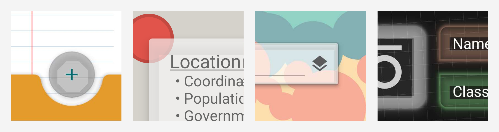
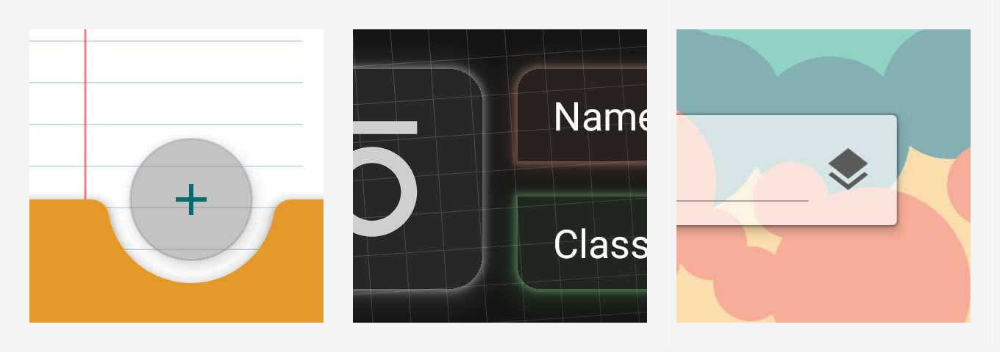
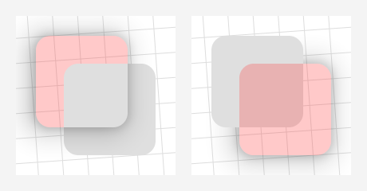
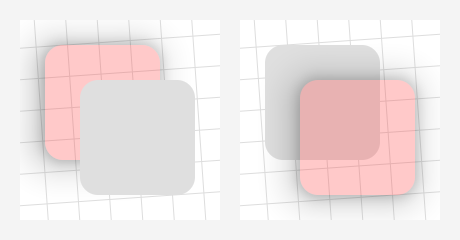
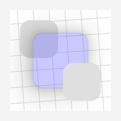
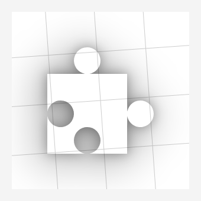

# Shadow Gadgets

A utility library for Android with various tools to help fix the elevation shadow artifacts visible on `View`s and `Composable`s with transparent or translucent backgrounds.



Those artifacts are a result of the hardware-accelerated shadows that came with the introduction of Material Design in Lollipop. The shadow gradient is left un-clipped everywhere, presumably as a performance consideration.

These tools use the same classes and methods that the platform uses to render shadows, simply replacing the originals with clipped copies.



<br />

## Basic usage with Compose

<sup>[[Download](#download)]</sup>

The `Modifier` extension function is called `clippedShadow()`. It works similarly to the regular `shadow()` except that there is no content clip parameter – since that can be handled with a separate `clip()` – and it does _not_ generate a new surface/graphics layer. It is purely decorative.

```kotlin
Box(
    Modifier
        .size(100.dp)
        .clippedShadow(
            elevation = 10.dp,
            shape = RoundedCornerShape(10),
            ambientColor = Color.Blue,
            spotColor = Color.Blue
        )
)
```

Unlike the `View` solution, you will need to disable the `Composable`'s inherent shadow yourself, if it has one. `Box` doesn't, but ones like `Card` and `Button` do, so you'll need to pass zeroes for their `elevation`s. The demo app has a few examples on the Compose page with the necessary settings, a couple of which also show how to replace the shadows on existing `Composable`s that animate their elevations without having to rewrite them or fiddle with their internals.

Since these shadows are drawn inline pretty much exactly like the regular ones, that should be about as complicated as the Compose version gets. It may take a few other adjustments to line things up correctly to begin with, but no more than it would for the regular `shadow()`, too.

Consequently, most of the rest of this document is geared toward the `View` version, though there might occasionally be some items relevant to the `compose` package in [the Notes](#notes) near the end.

<br />

## Basic usage with Views

<sup>[[Download](#download)] [[Reference](https://github.com/zed-alpha/shadow-gadgets/wiki/Clipped_Shadows)]</sup>

Nobody wants to mess with a whole library for such a small thing that should've already been handled in the native UI framework, so this was designed to be as simple and familiar as possible:

```kotlin
view.clipOutlineShadow = true
```

That's it. Unless your setup requires that a _sibling_ `View` overlap a target of the fix, or it involves a target with an irregular shape on Android R or above, that's possibly all you need.

The `Boolean`-value `clipOutlineShadow` extension property is basically a switch to toggle the fix on `View`s individually, and it's designed to mimic an intrinsic property as much as possible. Though the shadow is actually being handled and drawn in the parent `ViewGroup`, the property can be set on the target `View` at any time, even while it's unattached, so there's no need to worry about timing. Additionally, the clipped shadow automatically animates and transforms along with its target, and it will handle moving itself to any new parents, should the target be moved.

It is hoped that that simple usage should cover most cases, but for the situations mentioned above, the library offers a couple of configuration options as possible recourses. Those and a few other features and tools are discussed in the following content.

<br />


## Sections

+ [**Limitations and recourses**](#limitations-and-recourses)

    Android's continuing lockdown on reflection makes irregular shapes a bit of a problem on R+, but the only real Achilles' heel to the overall technique is overlapping sibling `View`s.

+ [**ViewGroups**](#viewgroups)

    The library offers a few customized Recycling `ViewGroup`s that are optimized for handling these clipped shadows on all of their children, and several Regular ones that are mainly meant to allow the shadow properties to be set on their children from corresponding attributes in layout XML.

+ [**Drawable**](#drawable)

    A relatively simple `Drawable` class is provided to create "independent" shadows from `View`s or `Path`s. This may be useful as another fix option, or even as a design element on its own.

+ [**Notes**](#notes)

    General notes, caveats, etc.

+ [**Download**](#download)

    Available through JitPack, currently.

+ [**API reference**](https://github.com/zed-alpha/shadow-gadgets/wiki#api-reference)

    Complete listing of the public API. (Currently out of date, but mostly correct.)

<br />


## Limitations and recourses

### Overlapping sibling Views

<sup>[[Reference](https://github.com/zed-alpha/shadow-gadgets/wiki/Clipped_Shadows#clippedShadowPlane)]</sup>

The main limitation is inherent to the technique used here, which was chosen because it allows the fix to be externally applied to any `View` without having to modify it or its existing setup. That method is basically to disable the target's built-in shadow and draw a clipped copy either in front of or behind it. Since the shadow is essentially pulled out of the normal draw routine, it's possible to end up with different kinds of artifacts than those which we're trying to fix.



On the left, the red target has a lower elevation than its plain, gray sibling, but the default `Foreground` plane draws in front of everything. On the right, the red target is higher than the gray sibling, but its `Background` shadow draws behind all of the child `View`s.

It is important to note that this is an issue only for _siblings_ of the target. `View`s in separate parent `ViewGroup`s have separate draws and won't interfere with each other. Indeed, in some cases the most straightforward solution is to simply wrap a target or sibling in another `ViewGroup`, like a plain old `FrameLayout`. There are certainly cases where siblings must overlap, however, hence the next core property and its corresponding enum class:

#### ClippedShadowPlane
```kotlin
enum class ClippedShadowPlane { Foreground, Background, Inline }
```

The `View.clippedShadowPlane` extension property sets the "plane" on which the clipped shadow will be drawn:

+ `Foreground` draws in the overlay of the target's parent `ViewGroup`, after all of the children. It is the default.

+ The `Background` plane draws behind the parent's content, immediately after its background drawable.

+ The new `Inline` type is drawn right along with the target itself, and is most similar in behavior and appearance to the regular shadows, but it has some additional requirements and caveats, which is why it's not the default option.

For example, the setups from the images above fixed:



On the left, we've set `redView.clippedShadowPlane = Background`, moving the shadow draw to the back. The setup on the right was fixed by letting it draw to the `Foreground` plane, which is the default. The new `Inline` plane would fix both situations:



Though `Inline` shadows seem to be the most appropriate solution, they behave a bit differently than the others, and have additional external requirements in order to function correctly.

+ **Non-library parents:** Since it's drawn along with the target `View` itself, an `Inline` shadow will work inside non-library parent `ViewGroup`s _only_ if the target `View` is not being otherwise clipped by anything else. Specifically:

    + The parent `ViewGroup` must have `clipChildren` set to `false`. The default value is `true`, so this has to be set manually in pretty much any `ViewGroup`.

    + The target `View` itself must have `clipToOutline` set to `false`, which is the default value for the `View` class, but certain subclasses enable it internally; e.g., `CardView` and its variants.

    If either of those is `true`, the shadow will be mostly or completely invisible, which is one of the main reasons that `Inline` is not the default. There is a rather explicit warning log, though, if one of these shadows is used in such a setup.

+ **Library parents:** If an `Inline` shadow is on a target that is a child of one of the library's `ClippedShadowsViewGroup`s, the `clipChildren` and `clipToOutline` settings are not necessary, as the draw is handed off to the parent where it's inserted before those child clip operations happen.

    However, to be able to insert these draws between children, `ClippedShadowsViewGroup`s have to manually reorder the child draws, which adds a tiny bit of overhead and prevents some of the low-level optimizations that hardware-acceleration brought in the first place.

If you're able to specify the above-mentioned clip settings, `Inline` shadows in non-library parents actually have the least overhead of any type. The special behavior in library parents simply offers another possible fix option for particular setups and requirements.

### Irregular shapes on Android R+

The other notable limitation comes on Android R and above, when creating the copy for `View`s with irregular shapes; i.e., `View`s that aren't rectangles, regular round rectangles, or circles. Reflection is required to get at the `Path` that describes those irregular shapes, and the increasing restrictions on non-SDK interfaces have finally made that field inaccessible. For these cases, the library has a `ViewPathProvider` interface that works very similarly to the framework's `ViewOutlineProvider` class, allowing the user to set the necessary `Path`. For example:

```kotlin
@RequiresApi(30)  // Just to keep the example short
class PuzzlePieceView constructor(
    context: Context,
    attrs: AttributeSet? = null
) : View(context, attrs) {

    private val viewPath = Path()

    private val paint = Paint(Paint.ANTI_ALIAS_FLAG)

    init {
        outlineProvider = object : ViewOutlineProvider() {
            override fun getOutline(view: View, outline: Outline) {
                val sideLength = minOf(view.width, view.height).toFloat()
                viewPath.setToPuzzlePiece(sideLength)
                outline.setPath(viewPath)
            }
        }
        pathProvider = ViewPathProvider { _, path ->
            path.set(viewPath)
        }
        clipOutlineShadow = true

        paint.color = Color.argb(64, 0, 0, 255)
        outlineAmbientShadowColor = Color.BLUE
        outlineSpotShadowColor = Color.BLUE
        elevation = 15F
    }

    override fun onDraw(canvas: Canvas) {
        canvas.drawPath(viewPath, paint)
    }
}
```

The `setToPuzzlePiece()` function is available in the `demo` module, if you'd like a full working example to play around with ([link](/demo/src/main/java/com/zedalpha/shadowgadgets/demo/topic/DrawableTopic.kt#L93)). Give it a non-zero width and height, and it'll produce something like:



Do note that the `ViewPathProvider` is a fallback, not an override. It will only be checked if the library is unable to determine the `Path` on its own. If a non-empty `Path` cannot be resolved – with or without a `ViewPathProvider` set – then a shadow simply won't be drawn.

Also included in the library is the `MaterialComponentsViewPathProvider` object, a concrete implementation of this interface that will automatically handle figuring the `Path` on `View`s with a `MaterialShapeDrawable` background, which is how many modern library components get their overall shape and appearance.

```kotlin
shapedButton.pathProvider = MaterialComponentsViewPathProvider
```

This is a separate object that needs to be manually set so that `MaterialShapeDrawable` and related classes can be stripped at compile time, if they're not being used otherwise.

<br />


## ViewGroups

There are two general categories of `ViewGroup`s: Recycling and Regular.

### Recycling ViewGroups

<sup>[[Reference](https://github.com/zed-alpha/shadow-gadgets/wiki/Recycling_ViewGroups)]</sup>

By default, the library's shadow objects clean up after themselves whenever the target `View` is detached from the hierarchy. Since certain `ViewGroup`s like `ListView` and `RecyclerView` continually detach and reattach their children during scroll events, this would cause some rather inefficient handling with the default behavior. To that end, the library offers a handful of customized Recycling `ViewGroup` subclasses that are optimized for clipped shadows on all of their children.

The list of available Recycling `ViewGroup`s can be found on [their page in the API reference](https://github.com/zed-alpha/shadow-gadgets/wiki/Recycling_ViewGroups). Each implements a common library interface but otherwise behaves exactly like its superclass, and is a drop-in replacement in both code and XML. For example:

```xml
<com.zedalpha.shadowgadgets.view.viewgroup.ClippedShadowsRecyclerView
    android:id="@+id/recycler_view"
    android:layout_width="match_parent"
    android:layout_height="match_parent"
    … />
```

There is no special setup necessary, other than providing the `Adapter` that creates elevated, translucent items.

### Regular ViewGroups

<sup>[[Reference](https://github.com/zed-alpha/shadow-gadgets/wiki/Regular_ViewGroups)]</sup>

The Regular ones are meant merely to aid in setting the library's clipped shadow properties on children from corresponding attributes in layout XML. To that end, they each recognize the following attributes on child tags:

+ `app:clipOutlineShadow`
+ `app:clippedShadowPlane`

The XML values for each correspond to the code values as you would expect. For example:

```xml
<com.zedalpha.shadowgadgets.view.viewgroup.ClippedShadowsRelativeLayout
    xmlns:android="http://schemas.android.com/apk/res/android"
    xmlns:app="http://schemas.android.com/apk/res-auto">

    <Button
        android:id="@+id/translucent_button"
        …
        app:clipOutlineShadow="true"
        app:clippedShadowPlane="background" />

</com.zedalpha.shadowgadgets.view.viewgroup.ClippedShadowsRelativeLayout>
```

For the purposes of consistent behavior across all of the different `ViewGroup` types, these attributes will work properly _only_ on `View`s with IDs that are unique within the `ViewGroup`. They are ignored on children that do not have an `android:id`.

Each `ViewGroup` also has a few properties from the common interface, `ClippedShadowsViewGroup`, most of them simply conveniences for setting shadow properties on all of their children. The details for those can be found on [the relevant reference pages on the wiki](https://github.com/zed-alpha/shadow-gadgets/wiki/ViewGroups).

<br />


## Drawable

The previous class – `ShadowDrawable` – has been removed, technically, but the replacement is mostly similar, as far as available properties. The main upshot to the new class is that it no longer depends on `RenderNode` access, so we can use it freely without having to check availability first. Like everything else here, though, it still requires a hardware-accelerated `Canvas` to work.

`ClippedShadowDrawable` is essentially a very thin wrapper around the core class used to draw these shadows in the other tools. It's provided mainly as a convenience for those who would like to be able to draw these manually without having to mess with the `core` module directly (which can get very confusing). However, there are several ways in which it does not act like a regular `Drawable`:

+ The most important caveat here is that you are responsible for keeping the clip updated anytime a relevant property in the drawable changes. That is, if you change its rotation, for example, you need to invalidate the current draw. If the drawable's callback is set appropriately - e.g., like it would be when acting as a `View`'s background – then you likely need only to call `invalidateSelf()` on it. Otherwise, you'll need to `invalidate()` the `View` you're drawing in, or perform the analogous action in whatever context you're in.

    The reason this happens is that one of the features of `RenderNode`s is their ability to be transformed and rearranged without necessarily having to redraw their content, so it's possible to modify properties on them without the draw around them changing. If that happens with our shadows, the clip area won't be updated, and you could end up with possibly even worse artifacts than what we're trying to fix in the first place. The demo app has a Drawable page that demonstrates this pretty clearly.

+ The bounds have no effect whatsoever on the final draw. Though they should still be set appropriately where needed to ensure that things like the invalidation mechanism still work correctly, they will not translate or stretch or clip or do anything else to the actual shadow, whose shape and initial position come solely from the `Outline` set. After that, transformations can be applied either through `Canvas` functions before the draw – e.g., `canvas.translate(dx, dy)` – or by setting the relevant properties on the drawable itself – e.g., `drawable.translationX = dy; drawable.translationY = dy`. The demo app has a simple subclass example that automatically centers the shadow within the bounds, to show how you could customize the class to your needs.

+ It is rather important to `dispose()` of these drawables when appropriate – e.g., in a `Fragment`'s `onDestroyView()` – at least until your `minSdk` is 29, at which point you can use the constructor that doesn't require an owner `View` to hook into the hardware-accelerated draw routine. Use after disposal is not an automatic `Exception`, but it's not advised, and there is no guaranteed behavior.

+ `Drawable`'s required `setColorFilter()` override is currently a no-op.

<br />


## Notes

+ The docs in the wiki are currently out of date, and this README isn't as detailed as it should be yet. They will be updated in the near future, hopefully.

+ If you only need the fix for `View`s in a simple static setup or two – e.g., a basic `CardView` – you might prefer to put something together from the core techniques demonstrated in [this Stack Overflow answer](https://stackoverflow.com/a/70076301). The main benefits of this library are its additional features on top of those methods, like its automatic handling of target state and animations. If that core solution is sufficient, you probably don't want the overhead here.

+ Starting with 2.0.0, `ShadowFallbackStrategy` and its corresponding extension property are removed as obsolete. The fallback draw implementation now works just like the primary one, obviating the need for that particular option.

+ Colored shadows are supported on Pie and above, technically. They absolutely do work for Q+, but I cannot get colored shadows to work _at all_ on Pie itself, with or without this library involved. All of the relevant methods and attributes were introduced with that version, and the documentation indicates that they should work like normal, but none of the emulators I've tested on show anything but black shadows. The code is in place here for Pie, though, if it's somehow functional for other installations. The demo app's Intro page has a setup that lets you fiddle with the shadow color, so that could be used as a quick test, if you're curious.

+ To disable the target's inherent shadow, its `ViewOutlineProvider` is wrapped in a custom implementation. This has the possibility of breaking something if some function or component is expecting the `View` to have one of the static platform implementations; i.e., `ViewOutlineProvider.BACKGROUND`, `BOUNDS`, or `PADDED_BOUNDS`. This shouldn't cause a fatal error, or anything – it's no different than anything else that uses a custom `ViewOutlineProvider` – but you might need to rework some background drawables or the like.

    This also means that if you are using a custom `ViewOutlineProvider` of your own on a target, it should be set _before_ enabling the clipped shadow, or at least before the target `View` attaches to its `Window`.

+ To be able to draw the clipped shadows in the `Background` plane, the parent `ViewGroup` itself must have a non-null background. If it does not have one at the time that such a shadow is added, a special library `object` is set automatically. For efficiency, this is the only time it is checked, so you should _not_ set the parent's background to specifically `null` any time it has `Background` shadows active. Any other non-null value is perfectly fine, but otherwise, the clipped shadows in that plane may end up drawing on the wrong background, possibly disappearing completely.

+ The layout inflation helpers' description and demonstration have been wholly removed to the wiki. They are a rather niche tool, unlikely of much use to others, and probably won't be updated any further, apart from possible minor maintenance.

+ The demo app was designed and tested on 1080x1920 xxhdpi devices and not much else, so things might not look that great on other configurations. Just a heads up.

<br />


## Download

The initial releases are available through JitPack. In the appropriate `repositories`, simply add their Maven URL:

```gradle
repositories {
    google()
    mavenCentral()
    maven { url "https://jitpack.io" }
}
```

then add a dependency for [the latest release](https://github.com/zed-alpha/shadow-gadgets/releases) of whichever module you need, `view` or `compose`:

```gradle
dependencies {
    …
    implementation 'com.github.zed-alpha.shadow-gadgets:view:[latest-release]'
    implementation 'com.github.zed-alpha.shadow-gadgets:compose:[latest-release]'
}
```

You can also get the `core` module directly, if you'd like, but I've not had time to put together any documentation or examples for it.

<br />


## License

MIT License

Copyright (c) 2023 ZedAlpha

Permission is hereby granted, free of charge, to any person obtaining a copy of this software and
associated documentation files (the "Software"), to deal in the Software without restriction,
including without limitation the rights to use, copy, modify, merge, publish, distribute,
sublicense, and/or sell copies of the Software, and to permit persons to whom the Software is
furnished to do so, subject to the following conditions:

The above copyright notice and this permission notice shall be included in all copies or substantial
portions of the Software.

THE SOFTWARE IS PROVIDED "AS IS", WITHOUT WARRANTY OF ANY KIND, EXPRESS OR IMPLIED, INCLUDING BUT
NOT LIMITED TO THE WARRANTIES OF MERCHANTABILITY, FITNESS FOR A PARTICULAR PURPOSE AND
NONINFRINGEMENT. IN NO EVENT SHALL THE AUTHORS OR COPYRIGHT HOLDERS BE LIABLE FOR ANY CLAIM, DAMAGES
OR OTHER LIABILITY, WHETHER IN AN ACTION OF CONTRACT, TORT OR OTHERWISE, ARISING FROM, OUT OF OR IN
CONNECTION WITH THE SOFTWARE OR THE USE OR OTHER DEALINGS IN THE SOFTWARE.