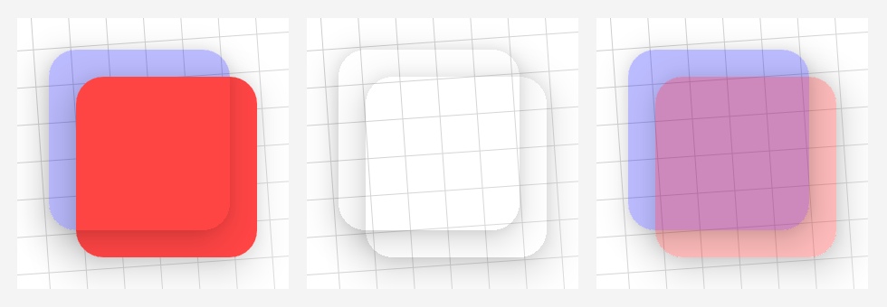
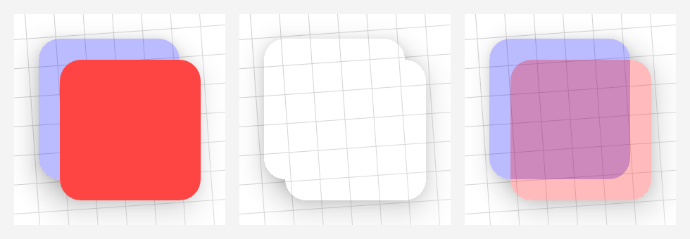

# Shadow Gadgets

A utility library for Android with various tools to fix the elevation shadow artifacts visible on `View`s<sup>*</sup> with transparent or translucent backgrounds.


Those artifacts are a result of the hardware-accelerated shadows that came with the introduction of Material Design in Lollipop. The shadow gradient is left un-clipped everywhere, presumably as a performance consideration. These tools use the same classes and methods that the platform uses to render shadows, simply replacing the originals with clipped copies.


---

<sup><sup>*</sup> Compose UI suffers from the same issue, as it's ultimately using the same `RenderNode` APIs as the `View` framework. However, this library currently works only with `View`s. Compose UI integration is the first planned major update, if they haven't rolled their own separate shadow implementation by then, which I suspect they're planning. The platform shadows are rather limited.</sup>


## Sections

+ [Overlay shadows](#overlay-shadows)

    An extension property on `View` allows for easy application of the fix in the form of a clipped shadow replica drawn onto the target's parent's overlay. Simple and straightforward, it has a few limitations inherent to the technique, but it is indeed sufficient for many, if not most, use cases.

+ [Custom containers](#custom-containers)

    These `ViewGroup`s fix their children's shadows by handling them inline, and so do not suffer some of the limitations of the overlay shadows. At present, they can only be used directly, but they will eventually be added as options to the inflation helpers.

+ [Drawables](#drawables)

    A relatively simple `Drawable` class is provided to create "independent" shadows from either a `View` or a `Path`. Hopefully this might help to cover any unforeseen cases, or any for which the other solutions may be insufficient or inappropriate.

+ [Layout inflation helpers](#layout-inflation-helpers)

    These helpers insert themselves into the inflation pipeline to automatically enable the overlay fix on selected tags and `View`s. This is handy if you'd like to add it to an existing project with minimal changes, or if you'd just rather not clutter your code with the necessary property settings.

+ [Notes](#notes)

    Overall limitations and conflicts, known bugs, planned features, etc.

+ [Download](#download)

    Available through JitPack, currently.

+ [API reference](#api-reference)

    Complete listing of the public API.

+ [License](#license)

    Standard MIT.


## Overlay shadows

[[API reference](#overlay-shadows-1)]

This functionality is provided by a `Boolean`-value extension property on `View` called `clipOutlineShadow`, in keeping with similar platform method names. It's essentially a switch to toggle the overlay fix on `View`s individually. For example:

```kotlin
if (!view.clipOutlineShadow) view.clipOutlineShadow = true
```

That's it. It behaves like any other such `View` property. The `if` check is strictly illustrative, and is not required before setting either value.

### Limitations and conflicts

+ As mentioned, this tool draws a clipped replica of the target's shadow onto its parent's overlay, after disabling the inherent shadow. This has the benefit of requiring no other setup or management, but since the shadows are effectively pulled to the front of the parent, overlapping sibling `View`s can cause flaws in the resulting draw.

    The library actually has two different methods to draw the clipped shadows, to help ensure that it works on every relevant Android version. With the primary method, overlapping siblings would look something like this:

    

    All three images are of the same basic setup: a blue target z-ordered behind its red sibling. The left shows an opaque red sibling, the right a translucent one, and in the center they are both completely transparent, so it's easier to see exactly what the shadows are doing in the the intersections.

    The fallback method ends up with a slightly different defect. With this method, the shadows' interiors are clipped all at once, so they are missing completely from the the overlapping areas here:

    

    Possibly the simplest remedy for this would be to wrap one or more of the siblings in another `ViewGroup` – e.g., in a `<FrameLayout>` – which would would isolate the shadow draws. The custom containers are in the process of being modified to handle overlapping children, but that feature is not quite ready yet.

+ Certain animations can sometimes cause the overlay shadow to fall out of alignment with the target a bit during the motion. The demo app has a `CoordinatorLayout` setup on the second Overlay page that has the potential to show this defect. The custom containers described in the next section are optimized to avoid this, and should help to alleviate it, if you find that your setup is affected.

+ Please also consult [the Notes section below](#notes) for further issues overall.


## Custom containers

[[API reference](#custom-containers-1)]

The library offers a handful of subclasses of common `ViewGroup`s that handle the clipped shadows inline with their child draw routines in an effort to avoid some of the limitations of the overlay approach, and to optimize for better performance in ones like `RecyclerView`. They are broadly divided into Regular and Recycling categories, and each is a drop-in replacement for the corresponding platform/androidx class.

### Regular containers

+ `ClippedShadowsFrameLayout`
+ `ClippedShadowsRelativeLayout`
+ `ClippedShadowsCoordinatorLayout`

By default, all of the regular ones apply the fix selectively; i.e., they fix only the children that are marked to be. The `clipAllChildShadows` attribute is available to change that behavior. For example:

```xml
<com.zedalpha.shadowgadgets.viewgroup.ClippedShadowsRelativeLayout
    xmlns:android="http://schemas.android.com/apk/res/android"
    xmlns:app="http://schemas.android.com/apk/res-auto"
    android:id="@+id/root"
    …
    app:clipAllChildShadows="true">
```

Otherwise, there are two ways to mark a child as a target for the fix: with a custom attribute, or with a specific tag value. The first way is quite familiar:

```xml
<com.zedalpha.shadowgadgets.viewgroup.ClippedShadowsRelativeLayout …>

    <Button
        …
        app:clipOutlineShadow="true" />
```

Unfortunately, `CoordinatorLayout` does not allow custom `LayoutParams` to be inflated from XML so the `clipOutlineShadow` attribute won't work for its children, thus the need for a second method. As an alternative, `ClippedShadowsCoordinatorLayout` (and therefore the other regular ones, as well) will look for children with a specific tag value:

```xml
<com.zedalpha.shadowgadgets.viewgroup.ClippedShadowsCoordinatorLayout …>

    <Button
        …
        android:tag="@string/clip_outline_shadow_tag_value" />
```

If you're already using the `android:tag` attribute for something else, that value can instead be added as a `<tag>` keyed with a specific library ID:

```xml
<com.zedalpha.shadowgadgets.viewgroup.ClippedShadowsCoordinatorLayout …>

    <Button …>

        <tag
            android:id="@id/clip_outline_shadow_tag_id"
            android:value="@string/clip_outline_shadow_tag_value" />

    </Button>
```

### Recycling containers

The other main container category is recycling `ViewGroup`s, and they are as follows:

+ `ClippedShadowsListView`
+ `ClippedShadowsGridView`
+ `ClippedShadowsRecyclerView`

These three all assume that all of their children will be targets, so the parent attribute and child markings described for the regular `ViewGroup`s are ignored here. It should be mentioned that `ClippedShadowsListView` and `ClippedShadowsGridView` both have default styles that set `android:listSelector` and `android:cacheColorHint` to be fully transparent, due to possible conflicts caused in part by the `ViewOutlineProvider` caveat described in [the Notes section](#notes).

### Limitations

+ At present, all of the containers always use the fallback drawing method, as there is an unforeseen issue with z-ordering in the primary method. That means that overlapping children will be missing the shadows altogether inside the intersections, as described in [the overlays' limitations](#limitations-and-conflicts).

+ Currently, the containers' behavior in the Android Studio graphical layout editor is a little flaky. Each will still work as the base `ViewGroup` that it is, but it may or may not fix the shadows there, and sometimes it can interfere with a child's content draw. I'm not yet sure exactly why, but I'm assuming it has something to do with the specialized rendering pipeline for the editor.

+ Please check [the Notes](#notes) for further issues that can affect the containers.


## Drawables

[[API reference](#drawables-1)]

The last rendering tool is `ShadowDrawable`, which allows us to create "disembodied" shadows as a further possible option for applying the fix in unforeseen cases, or ones where the other options are insufficient, for whatever reason. It also lets us draw the shadow effect of elevated `View`s without needing the actual `View`s, which likely has at least a couple of applications, I would think. Please note that, just like normal `View` shadows, this only works with hardware-accelerated `Canvas`es.

Before creating any instances, you must first check that `ShadowDrawable.isAvailable` returns `true`. For the clipping technique to be applicable through the `Drawable` mechanism, it requires the primary shadow drawing method. If that is not available in the current environment, that property will return `false`, and any use of the factory methods will throw an `IllegalStateException`. However, every effort has been made to make this available on all relevant Android versions, including the use of methods that are too slow for the overlay and container approaches. Since any instances of this would necessarily be controlled directly, it does not have the `View`-tracking overhead of those approaches, so the slower methods are adequate here.

The class offers two factory functions for instantiating `ShadowDrawable`s: `fromView(view: View)` and `fromPath(path: Path)`. For example:

```kotlin
val drawable = if (ShadowDrawable.isAvailable) ShadowDrawable.fromView(fab) else ColorDrawable(Color.WHITE)
```

`fromView()` will create a snapshot drawable from the `View`'s current state, including its elevation, shadow colors, etc. `fromPath()` will create an instance with bounds described by `path`, but it will _not_ have any other properties set. That means that its default z-offset will be zero, and it will cast no shadow until its `elevation` and/or its `translationZ` is set to a positive value.

Note that `fromView()` does no check as to the `View`'s current state; it doesn't even ensure that it's been laid out yet. It is very easy to end up with an empty or incorrect drawable from a `View`; e.g., by trying to create it in the `Activity`'s `onCreate()` method, or before the `View` has animated itself fully, etc.

It's also important to note that this drawable's bounds describe its _inner_ border, not its outside edge. It works exactly like a shadow on a `View` with the given bounds, just without the `View` itself in the middle.

After instantiation, you can modify the drawable using the `updateFromView(view: View)` and `updateFromPath(path: Path)` functions, and through several individual properties that correspond to those in the `View` class that normally affect and transform shadows; e.g, `elevation`, `rotationX`, `scaleY`, etc. Given that, the only thing for which this `Drawable` uses its bounds is the `left` and `top` positioning. Though it will automatically center the drawn shadow within its bounds, it will not shrink, or stretch, or any other operation that can be accomplished with those properties.

Also offered is the `var fillPaint: Paint?` property, which provides a simple way to fill the interior after the shadow draw.

`Drawable`'s required `setColorFilter()` override is currently a no-op here.


## Layout inflation helpers

[[API reference](#layout-inflation-helpers-1)]

For more than a handful of `View`s, setting the overlay property individually in code is tedious and bulky, so the library also offers a few ways to set it automatically by inserting a helper into the layout inflation pipeline. Since a standard setup these days often involves a Material Components theme on an `AppCompatActivity`, we'll use that one to illustrate the main points. The differences in usage for regular AppCompat themes, and for non-library `Activity` classes, follow the description of Tag Matchers, which are common to all three arrangements.


### Material Components Helper

The helper class for this version is `MaterialComponentsShadowHelper`, and it can be attached either through resources, or programmatically in the `Activity` itself.

+ #### Through resources

    In the relevant theme, this helper class is set as the `viewInflaterClass`.

    ```xml
    <style name="Theme.YourApp" parent="Theme.MaterialComponents…">
        …
        <!-- You can use either the fully qualified class name… -->
        <item name="viewInflaterClass">com.zedalpha.shadowgadgets.inflation.MaterialComponentsShadowHelper</item>

        <!-- Or, a string resource of that name is also provided, as a convenience. -->
        <item name="viewInflaterClass">@string/material_components_shadow_helper</item>
    </style>
    ```

+ #### Programmatically

    In code, the `attachMaterialComponentsShadowHelper()` extension function on `AppCompatActivity` simply sets that `viewInflaterClass` value dynamically, for the current `Activity` instance only. It must be called _before_ the `super.onCreate()` call.

    ```kotlin
    class MaterialComponentsActivity : AppCompatActivity(R.layout.activity_material_components) {
        override fun onCreate(savedInstanceState: Bundle?) {
            attachMaterialComponentsShadowHelper()
            super.onCreate(savedInstanceState)
            …
        }
    }
    ```

By default, the helper looks for any `View` tag with the `clipOutlineShadow` attribute set to `true`. For example:

```xml
<com.google.android.material.button.MaterialButton
    xmlns:app="http://schemas.android.com/apk/res-auto"
    android:id="@+id/translucent_button"
    …
    app:clipOutlineShadow="true" />
```


### Common: Tag Matchers

If you'd rather not modify layout files to add the `clipOutlineShadow` attribute, you can instead create `TagMatcher`s to select certain tags on which to enable the fix. These `TagMatcher`s can be defined in resource XML (`R.xml`) files, or in code.

+ #### In resource XML

    Standard matchers can be defined in XML files, with a very simple set of available elements and attributes. For example:

    ```xml
    <matchers
        xmlns:android="http://schemas.android.com/apk/res/android"
        xmlns:app="http://schemas.android.com/apk/res-auto">

        <id android:id="@id/translucent_button" />
        <id android:name="translucent_button" />
        <id android:name="translucent_" app:matchRule="startsWith" />
        <name android:name="Button" app:matchRule="endsWith" />
    </matchers>
    ```

    The parser is quite lenient and basically ignores everything except the `<id>` and `<name>` tags, and the `android:id`, `android:name`, and `app:matchRule` attributes. All of the example elements shown above will match the aforementioned `<com.google.android.material.button.MaterialButton>` tag.

    IDs can be matched either by exact reference with the normal syntax, as shown in the first `<id>` element, or by name with a string matching rule, as shown in the next two. The default rule is `equals` (which need not be specified) and the others are `contains`, `startsWith`, and `endsWith`.

    Name matchers are valid only with an `android:name` attribute. Similar to IDs the default rule is `equals`, and the other rules are all applicable to this, as well.

    The XML resource can be specified to the helper through resources either with the `shadowTagMatchers` theme attribute:

    ```xml
    <style name="Theme.YourApp" parent="Theme.MaterialComponents…">
        …
        <item name="viewInflaterClass">@string/material_components_shadow_helper</item>
        <item name="shadowTagMatchers">@xml/matchers</item>
    </style>
    ```

    Or with a `<meta-data>` element in the manifest:

    ```xml
    <application …>

        <activity
            android:name=".MaterialComponentsActivity"
            android:theme="@style/Theme.MaterialComponents…">
            <meta-data
                android:name="com.zedalpha.shadowgadgets.SHADOW_TAG_MATCHERS"
                android:resource="@xml/matchers" />
        </activity>

    </application>
    ```

    The helper first looks for the theme attribute to obtain the appropriate XML resource. If the attribute is not present, it will look for a `<meta-data>` tag in the `<activity>` element, and then for a `<meta-data>` in the `<application>` element.

+ #### Programmatically

    The `attachMaterialComponentsShadowHelper()` function has an overload that takes a `List<TagMatcher>`. The two standard matchers can be constructed at runtime with the `idMatcher()` and `nameMatcher()` functions. To demonstrate, the matchers from the XML resource above can be replicated in code like so:

    ```kotlin
    class MaterialComponentsActivity : AppCompatActivity(R.layout.activity_material_components) {
        override fun onCreate(savedInstanceState: Bundle?) {
            attachMaterialComponentsShadowHelper(
                listOf(
                    idMatcher(R.id.translucent_button),
                    idMatcher(matchName = "translucent_button"),
                    idMatcher(matchName = "translucent_", matchRule = MatchRule.StartsWith),
                    nameMatcher("Button", MatchRule.EndsWith)
                )
            )
            super.onCreate(savedInstanceState)
            …
        }
    }
    ```

    If you need further and/or different options for matching, `TagMatcher` is a simple `interface` that you can implement yourself.

    ```kotlin
    interface TagMatcher {
        fun matches(view: View, tagName: String, attrs: AttributeSet): Boolean
    }
    ```

    The first parameter is the `View` object inflated from the XML tag described by the subsequent two parameters. You must return `true` from `matches()` for the clip to be enabled automatically.

+ #### Hybrid

    Additionally, `attachMaterialComponentsShadowHelper()` has one more overload that takes an `R.xml` so you can construct the matchers list from XML at runtime, simply as another configuration option.

    ```kotlin
    class MaterialComponentsActivity : AppCompatActivity(R.layout.activity_material_components) {
        override fun onCreate(savedInstanceState: Bundle?) {
            attachMaterialComponentsShadowHelper(R.xml.matchers)
            super.onCreate(savedInstanceState)
            …
    ```

Though regular AppCompat themes and platform Activities require different helper classes than Material Components, these `TagMatcher` definitions and implementations are common to all three variations.


### AppCompat Helper

The only differences between this version and the Material Components one above are the names of the helper class and attach function. They are kept wholly separate mainly to allow those not using Material Components to have the pertinent components stripped at build time.

+ #### Through resources

    ```xml
    <style name="Theme.YourApp" parent="Theme.AppCompat…">
        …
        <!-- Either -->
        <item name="viewInflaterClass">com.zedalpha.shadowgadgets.inflation.AppCompatShadowHelper</item>

        <!-- Or -->
        <item name="viewInflaterClass">@string/appcompat_shadow_helper</item>
    </style>
    ```

+ #### Programmatically

    In code, the relevant function is named `attachAppCompatShadowHelper()` instead.

    ```kotlin
    class CompatActivity : AppCompatActivity(R.layout.activity_compat) {
        override fun onCreate(savedInstanceState: Bundle?) {
            attachAppCompatShadowHelper()
            super.onCreate(savedInstanceState)
            …
        }
    }
    ```

    It also must be called before the `super.onCreate()` call, and has available the same overloads as `attachMaterialComponentsHelper()`.


### Platform Helper

In code, using this with a platform `Activity` class is quite similar to the library setups, the analogous function named simply `attachShadowHelper()` in this case.

+ #### Programmatically

    ```kotlin
    class PlatformActivity : Activity() {
        override fun onCreate(savedInstanceState: Bundle?) {
            super.onCreate(savedInstanceState)
            attachShadowHelper()
            setContentView(R.layout.activity_platform)
            …
        }
    }
    ```

    Note, however, that the attach function is called immediately _after_ the `super.onCreate()` call this time, though still before the first call to `setContentView()`.

+ #### Through resources

    Unfortunately, there is no `viewInflaterClass` attribute in the platform; that is a feature of AppCompat (and therefore Material Components, as well). In order to be able to apply this externally, without needing to modify the `Activity` classes, the attach function can be called on the `Activity` instances as they're passed to an `ActivityLifecycleCallbacks` object registered in a custom `Application` class. For example:

    ```kotlin
    class ShadowHelperApplication : Application() {
        override fun onCreate() {
            super.onCreate()
            registerActivityLifecycleCallbacks(object : ActivityCreatedCallback {
                override fun onActivityCreated(activity: Activity, savedInstanceState: Bundle?) {
                    activity.attachShadowHelper()
                }
            })
        }
    }
    ```

    where `ActivityCreatedCallback` is an `interface` extending `ActivityLifecycleCallbacks` with empty defaults for the unused functions. This class unconditionally attaches the platform helper to every `Activity`. If that happens to be sufficient for your setup, `ShadowHelperApplication` is actually included in the library, and can be applied like any other custom `Application`.

    ```xml
    <application
        android:name="com.zedalpha.shadowgadgets.inflation.ShadowHelperApplication"
        … />
    ```

    If you need to alter that behavior, or to integrate this with an existing `Application` subclass, you can use `ShadowHelperApplication` as just an example.


## Notes

### Overall limitations and conflicts

+ To disable the target's inherent shadow, its `ViewOutlineProvider` is wrapped in a custom implementation. This has the possibility of breaking something if some method or component is expecting the `View` to have one of the static platform implementations; i.e., `ViewOutlineProvider.BACKGROUND`, `BOUNDS`, or `PADDED_BOUNDS`. This shouldn't cause a fatal error, or anything – it's no different than anything else that uses a custom `ViewOutlineProvider` – but you might need to rework some background drawables or the like.

+ Starting with Android R, the overlays, the containers, and `ShadowDrawable.fromView()` will only work automatically on `View`s with "regular" `Outline`s; i.e., `View`s that are circles, rectangles, or round rectangles with the same radius for all corners. The increasing restrictions on non-SDK interfaces that began in Pie have finally removed access to the `Path` object necessary for irregular shapes.

    A future release will have some alternate method for these newer versions. In the meantime, you might be able to do something with `ShadowDrawable.fromPath()` instead, since it will still function normally.

+ Colored shadows are supported on Pie and above, technically. They absolutely do work for Q+, but I cannot get colored shadows _at all_ on Pie itself, with or without this library involved. The documentation indicates that they should work, and all of the relevant methods and attributes were introduced with that version, but none of the emulators I've tested on show anything but black shadows. The code is in place here for Pie, though, if it's somehow functional for other installations. The demo app has a page for colors which would be a quick and easy test for that.

+ The AppCompat and Material Components inflation helpers are (obviously) set as the `viewInflaterClass` in their respective configurations. If you're using anything other than the default inflaters that are handled internally by `AppCompatActivity`, then you might need to adapt or modify the helpers here, or possibly forgo them altogether.

### Known bugs

+ On the Lollipop versions, API levels 21 and 22, the fallback shadow drawing method has a bug in that a target `View` that is not visible on-screen while its shadow is clipped can cause an infinite invalidate loop, for as yet unknown reasons. This only affects the overlays if they're in fallback mode, but all of the containers are currently using only the fallback method, due to an open issue with primary one.

### Planned features:

+ Compose UI integration

+ Custom containers as inflation helper options


## Download

The initial releases are available through JitPack. In the appropriate `repositories`, simply add their Maven URL:

```gradle
repositories {
    google()
    mavenCentral()
    maven { url "https://jitpack.io" }
}
```

then add a dependency for [the latest release](https://github.com/zed-alpha/shadow-gadgets/releases):

```gradle
dependencies {
    …
    implementation 'com.github.zed-alpha.shadow-gadgets:library:[latest-release]'
}
```


## API reference

All types are non-null unless explcitly indicated with `?`.

### Overlay shadows

Package: `com.zedalpha.shadowgadgets`

+ **Extension properties**

    | `Boolean` | `var View.clipOutlineShadow` |
    | --- | --- |
    |     | Sets or gets the status of the overlay shadow fix on the receiver `View`. |


### Custom containers

Package: `com.zedalpha.shadowgadgets.viewgroup`

+ **Classes**

    ```kotlin
    class ClippedShadowsFrameLayout :
        android.widget.FrameLayout, ClippedShadowsContainer
    ```

    ```kotlin
    class ClippedShadowsRelativeLayout :
        android.widget.RelativeLayout, ClippedShadowsContainer
    ```

    ```kotlin
    class ClippedShadowsCoordinatorLayout :
        androidx.coordinatorlayout.widget.CoordinatorLayout, ClippedShadowsContainer
    ```

    ```kotlin
    class ClippedShadowsListView :
        android.widget.ListView, ClippedShadowsContainer
    ```

    ```kotlin
    class ClippedShadowsGridView :
        android.widget.GridView, ClippedShadowsContainer
    ```

    ```kotlin
    class ClippedShadowsRecyclerView :
        androidx.recyclerview.widget.RecyclerView, ClippedShadowsContainer
    ```

+ **Interfaces**

    ```kotlin
    interface ClippedShadowsContainer
    ```
    
    | `Boolean` | `val isUsingShadowsFallback` |
    | --- | --- |
    |     | Indicates whether the `ViewGroup` is using the fallback drawing method due to the primary one being unavailable. |

+ **XML attributes**

    | `boolean` | `app:clipOutlineShadow` | 
    | --- | --- |
    |     | Child attribute. Indicates whether to enable the fix for the given `<View>`. |

    | `boolean` | `app:clipAllChildShadows` | 
    | --- | --- |
    |     | Parent attribute. Indicates whether to enable the fix for all children of the parent. |

+ **Resources**

    | `id` | `clip_outline_shadow_tag_id` | 
    | --- | --- |
    |     | ID for use as the `android:id` in a `<tag>` to mark the child as a target for the fix. |

    | `string` | `clip_outline_shadow_tag_value` | 
    | --- | --- |
    |     | String for use as the value in an `android:tag` attribute, or as the `android:value` in a `<tag>`, to mark the child as a target for the fix. |


### Drawables

Package: `com.zedalpha.shadowgadgets.drawable`

```kotlin
class ShadowDrawable : android.graphics.drawable.Drawable
```

+ **Companion properties**

    | `static Boolean` | `val isAvailable` |
    | --- | --- |
    |     | Indicates whether `ShadowDrawable` can be used in the current environment. Must be checked before creating any instances. |

+ **Companion functions**

    | `static ShadowDrawable` | `fromView(view: View)` |
    | --- | --- |
    |     | Creates a drawable from the `View`'s current outline and state. |

    | `static ShadowDrawable` | `fromPath(path: Path)` |
    | --- | --- |
    |     | Creates a drawable with the bounds described by `path`. Only convex `Path`s are supported before API level 29 (Q), per platform restrictions. |

+ **Functions**

    | `Unit` | `updateFromView(target: View)` |
    | --- | --- |
    |     | Updates the instance from the `View`'s current outline and state. |

    | `Unit` | `updateFromPath(path: Path)` |
    | --- | --- |
    |     | Updates the instance with the given `Path`. This will only have affect on the shape and size of the shadow. Other properties are unmodified. |

+ **Properties**

    | `Float` | `var elevation` |
    | --- | --- |
    |     | Sets or gets the base z-offset for this drawable, in pixels. |

    | `Float` | `var pivotX` |
    | --- | --- |
    |     | Sets or gets the x-axis pivot point for the drawable. |

    | `Float` | `var pivotY` |
    | --- | --- |
    |     | Sets or gets the y-axis pivot point for the drawable. |

    | `Float` | `var rotationX` |
    | --- | --- |
    |     | Sets or gets the degrees of rotation around the x-axis for the drawable. |

    | `Float` | `var rotationY` |
    | --- | --- |
    |     | Sets or gets the degrees of rotation around the y-axis for the drawable. |

    | `Float` | `var rotationZ` |
    | --- | --- |
    |     | Sets or gets the degrees of rotation around the z-axis for the drawable. This is the one often referred to as just plain "rotation". |

    | `Float` | `var scaleX` |
    | --- | --- |
    |     | Sets or gets the horizontal scaling factor for the drawable. |

    | `Float` | `var scaleY` |
    | --- | --- |
    |     | Sets or gets the vertical scaling factor for the drawable. |

    | `Float` | `var translationX` |
    | --- | --- |
    |     | Sets or gets the x-axis offset for the drawable. |

    | `Float` | `var translationY` |
    | --- | --- |
    |     | Sets or gets the y-axis offset for the drawable. |

    | `Float` | `var translationZ` |
    | --- | --- |
    |     | Sets or gets the z-axis offset for the drawable. |

    | `Int` | `var ambientShadowColor` |
    | --- | --- |
    |     | Sets or gets the color for the shadow's ambient light source. Only available on API level 28 and above. |

    | `Int` | `var spotShadowColor` |
    | --- | --- |
    |     | Sets or gets the color for the shadow's spot light source. Only available on API level 28 and above. |

    | `Paint?` | `var fillPaint` |
    | --- | --- |
    |     | Sets or gets the (optional) `Paint` object used to fill the drawable's inner area after the shadow draw. |


### Layout inflation helpers

Package: `com.zedalpha.shadowgadgets.inflation`

+ **Classes**

    ```kotlin
    class ShadowHelperApplication : android.app.Application
    ```

    A simple `Application` subclass that unconditionally sets the platform shadow inflater helper on every `Activity` instance that is created. Included mainly for illustrative purposes.

+ **Interfaces**

    ```kotlin
    interface ActivityCreatedCallback :
        Application.ActivityLifecycleCallbacks
    ```
    
    | `Unit` | `onActivityCreated(activity: Activity, savedInstanceState: Bundle?)` |
    | --- | --- |
    |     | This is an adapter interface with empty defaults for all of `ActivityLifecycleCallbacks` functions except this one. |

    ```kotlin
    interface TagMatcher
    ```
    
    | `Boolean` | `matches(view: View, tagName: String, attrs: AttributeSet)` |
    | --- | --- |
    |     | Return `true` to to indicate a match. |

+ **XML attributes**

    | `boolean` | `app:clipOutlineShadow` | 
    | --- | --- |
    |     | Child attribute. Indicates whether to enable the fix for the given `<View>`. |

    | `reference` | `app:shadowTagMatchers` | 
    | --- | --- |
    |     | Theme attribute. Used to point to an XML resource from which to build tag matchers. |

    | `enum` | `app:matchRule` |
    | --- | --- |
    |     | Tag matcher attribute. Indicates comparison rule for string matching. |

    | `matchRule` | Runtime value |
    | --- | --- |
    | `equals` | `MatchRule.Equals` |
    | `contains` | `MatchRule.Contains` |
    | `startsWith` | `MatchRule.StartsWith` |
    | `endsWith` | `MatchRule.EndsWith` |

+ **Enums**

    | `enum class` | `MatchRule` |
    | --- | --- |
    |     | `Equals` corresponds to `String::equals`. |
    |     | `Contains` corresponds to `String::contains`. |
    |     | `StartsWith` corresponds to `String::startsWith`. |
    |     | `EndsWith` corresponds to `String::endsWith`. |

+ **Constants**

    | `String` | `META_DATA_TAG_MATCHERS` |
    | --- | --- |
    |     | Constant of the `name` for manifest `<meta-data>` elements that point to XML resources for tag matchers.<br />Value: "com.zedalpha.shadowgadgets.SHADOW_TAG_MATCHERS" |

+ **Extension functions**

    | `Unit` | `Activity.attachShadowHelper()` |
    | --- | --- |
    |     | Attaches the platform helper, and searches the theme and manifest for the (optional) matchers XML reference. Must be called before `setContentView()`. |

    | `Unit` | `Activity.attachShadowHelper(@XmlRes xmlResId: Int)` |
    | --- | --- |
    |     | Attaches the platform helper with matchers built from the provided XML resource. Must be called before `setContentView()`. |

    | `Unit` | `Activity.attachShadowHelper(matchers: List<TagMatcher>)` |
    | --- | --- |
    |     | Attaches the platform helper with the given list of matchers. Must be called before `setContentView()`. |

    | `Unit` | `AppCompatActivity.attachAppCompatShadowHelper()` |
    | --- | --- |
    |     | Attaches the helper for AppCompat themes, and searches the theme and manifest for the (optional) matchers XML reference. Must be called before `super.onCreate()`. |

    | `Unit` | `AppCompatActivity.attachAppCompatShadowHelper(@XmlRes xmlResId: Int)` |
    | --- | --- |
    |     | Attaches the helper for AppCompat themes with matchers built from the provided XML resource. Must be called before `super.onCreate()`. |

    | `Unit` | `AppCompatActivity.attachAppCompatShadowHelper(matchers: List<TagMatcher>)` |
    | --- | --- |
    |     | Attaches the helper for AppCompat themes with the given list of matchers. Must be called before `super.onCreate()`. |

    | `Unit` | `AppCompatActivity.attachMaterialComponentsShadowHelper()` |
    | --- | --- |
    |     | Attaches the helper for Material Components themes, and searches the theme and manifest for the (optional) matchers XML reference. Must be called before `super.onCreate()`. |

    | `Unit` | `AppCompatActivity.attachMaterialComponentsShadowHelper(@XmlRes xmlResId: Int)` |
    | --- | --- |
    |     | Attaches the helper for Material Components themes with matchers built from the provided XML resource. Must be called before `super.onCreate()`. |

    | `Unit` | `AppCompatActivity.attachMaterialComponentsShadowHelper(matchers: List<TagMatcher>)` |
    | --- | --- |
    |     | Attaches the helper for Material Components themes with the given list of matchers. Must be called before `super.onCreate()`. |

+ **Functions**

    | `TagMatcher` | `idMatcher(@IdRes matchId: Int = View.NO_ID, matchName: String? = null, matchRule: MatchRule = MatchRule.Equals)` |
    | --- | --- |
    |     | Creates a matcher to match a specific `R.id` exactly, or to match (possibly mutiple) ID names by a given comparison rule. |

    | `TagMatcher` | `nameMatcher(matchName: String, matchRule: MatchRule = MatchRule.Equals)` |
    | --- | --- |
    |     | Creates a matcher to match (possibly mutiple) tag names by a given comparison rule. |

The `AppCompatShadowHelper` and `MaterialComponentsShadowHelper` classes are both public in order to be accessible to the AppCompat framework. However, for the time being, they are not documented, intentionally.


## License

MIT License

Copyright (c) 2022 ZedAlpha

Permission is hereby granted, free of charge, to any person obtaining a copy of this software and
associated documentation files (the "Software"), to deal in the Software without restriction,
including without limitation the rights to use, copy, modify, merge, publish, distribute,
sublicense, and/or sell copies of the Software, and to permit persons to whom the Software is
furnished to do so, subject to the following conditions:

The above copyright notice and this permission notice shall be included in all copies or substantial
portions of the Software.

THE SOFTWARE IS PROVIDED "AS IS", WITHOUT WARRANTY OF ANY KIND, EXPRESS OR IMPLIED, INCLUDING BUT
NOT LIMITED TO THE WARRANTIES OF MERCHANTABILITY, FITNESS FOR A PARTICULAR PURPOSE AND
NONINFRINGEMENT. IN NO EVENT SHALL THE AUTHORS OR COPYRIGHT HOLDERS BE LIABLE FOR ANY CLAIM, DAMAGES
OR OTHER LIABILITY, WHETHER IN AN ACTION OF CONTRACT, TORT OR OTHERWISE, ARISING FROM, OUT OF OR IN
CONNECTION WITH THE SOFTWARE OR THE USE OR OTHER DEALINGS IN THE SOFTWARE.