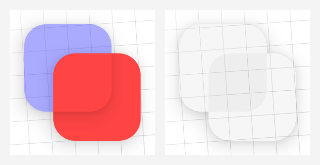
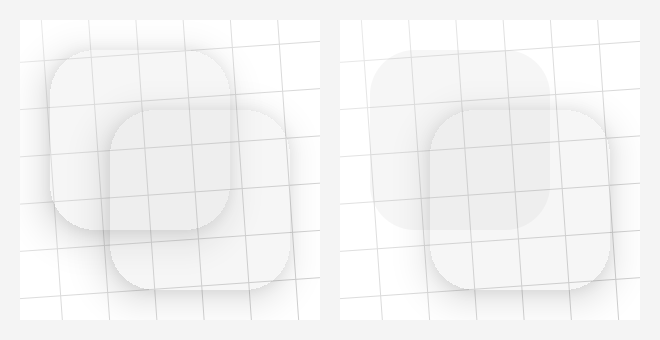

# Shadow Gadgets

A utility library for Android with various tools to help fix the elevation shadow artifacts visible on `View`s<sup>*</sup> with transparent or translucent backgrounds.


Those artifacts are a result of the hardware-accelerated shadows that came with the introduction of Material Design in Lollipop. The shadow gradient is left un-clipped everywhere, presumably as a performance consideration.

These tools use the same classes and methods that the platform uses to render shadows, simply replacing the originals with clipped copies.


---

<sup><sup>*</sup> Jetpack Compose suffers from the same issue, as it's ultimately using the same `RenderNode` APIs as the `View` framework. However, this library currently works only with `View`s. Independent solutions in Compose, and the arguable merits of including them in the library, are noted on [the home wiki page](https://github.com/zed-alpha/shadow-gadgets/wiki#jetpack-compose).</sup>

<br />


## Basic usage

<sup>[[Download](#download)] [[Reference](https://github.com/zed-alpha/shadow-gadgets/wiki/Clipped_Shadows)]</sup>

Nobody wants to mess with a whole library for such a small thing that should've already been handled in the native UI framework, so this was designed to be as simple and familiar as possible:

```kotlin
view.clipOutlineShadow = true
```

That's it. Unless your setup requires that a _sibling_ `View` overlap a target of the fix, or it involves a target with an irregular shape on Android R or above, that's possibly all you need.

The `Boolean`-value `clipOutlineShadow` extension property is basically a switch to toggle the fix on `View`s individually, and it's designed to mimic an intrinsic property as much as possible. Though the shadow is actually being handled and drawn in the parent `ViewGroup`, the property can be set on the target `View` at any time, even while it's unattached, so there's no need to worry about timing. Additionally, the clipped shadow automatically animates and transforms along with its target, and it will handle moving itself to any new parents, should the target be moved.

It is hoped that that simple usage should cover most cases, but for the situations mentioned above, the library offers a couple of configuration options as possible recourses. Those and a few other features and tools are discussed in the following:


## Sections

+ [**Limitations and recourses**](#limitations-and-recourses)

    Android's continuing lockdown on reflection makes irregular shapes a bit of a problem on R+, but the only real Achilles' heel to the overall technique is overlapping sibling `View`s.

+ [**ViewGroups**](#viewgroups)

    The library offers a few customized Recycling `ViewGroup`s that are optimized for handling these clipped shadows on all of their children, and several Regular ones that are mainly meant to allow the shadow properties to be set on their children from corresponding attributes in layout XML.

+ [**Drawable**](#drawable)

    A relatively simple `Drawable` class is provided to create "independent" shadows from `View`s or `Path`s. This may be useful as another fix option, or even as a design element on its own.

+ [**Notes**](#notes)

    General notes, caveats, etc.

+ [**Download**](#download)

    Available through JitPack, currently.

+ [**API reference**](https://github.com/zed-alpha/shadow-gadgets/wiki#api-reference)

    Complete listing of the public API.

<br />


## Limitations and recourses

For context here, the library's overall technique is essentially disabling the target's built-in shadow, and drawing a clipped copy in its place.

### Irregular Shapes on Android R+

The first limitation comes on Android R and above, when creating the copy for `View`s with irregular shapes; i.e., `View`s that aren't rectangles, regular round rectangles, or circles. Reflection is required to get at the `Path` that describes those irregular shapes, and the increasing restrictions on non-SDK interfaces have finally made that field inaccessible. There is no direct workaround option for this yet – the next release will have something that works automatically with common Jetpack components – but you might be able to do something with `ShapeDrawable` in the meantime, if you really need it, though you will have to provide the `Path`.

### Overlapping Sibling Views

<sup>[[Reference](https://github.com/zed-alpha/shadow-gadgets/wiki/Clipped_Shadows#clippedShadowPlane)]</sup>

The second and main limitation is inherent to the technique. The clipped shadow copies are drawn outside of the normal child draw routine of the parent `ViewGroup`, and by default are overlaid on top of its content. In many cases this is just fine, and is visually indistinguishable from the shadow being drawn normally. The issue comes when a target is overlapped by a sibling `View`, which can cause different kinds of unwanted artifacts.



<sup>_On the left, blue's shadow overlays its higher sibling. On the right, shadows are missing within their bounds._</sup>

It is important to note that this is an issue only for _siblings_ of the target. `View`s in separate parent `ViewGroup`s have separate draws and won't interfere with each other. Indeed, in some cases the most straightforward solution is to simply wrap a target or sibling in another `ViewGroup`, like a plain old `FrameLayout`. There are certainly cases where siblings must overlap, however, hence the other two core properties and the corresponding enum classes: `ClippedShadowPlane` and `ShadowFallbackStrategy`.

<br />

#### ClippedShadowPlane
```kotlin
enum class ClippedShadowPlane { Foreground, Background }
```

The `View.clippedShadowPlane` extension property sets the "plane" on which the clipped shadow will be drawn: the parent `ViewGroup`'s `Foreground` or `Background`.

For example, in the left image above, directing the blue target's shadow to draw on the background plane – e.g., `blueView.clippedShadowPlane = Background` – fixes its clipped shadow which was being incorrectly drawn over the red sibling.


Just like `View.clipOutlineShadow`, and `View.shadowFallbackStrategy` below, this property can be set on the target `View` at any time.

<br />

#### ShadowFallbackStrategy
```kotlin
enum class ShadowFallbackStrategy { None, ChangePlane, DisableShadow }
```

The second property is a little more subtle. The library actually uses two different drawing methods to help ensure that it works on all relevant Android versions. The primary method is always preferred but may not be available on Android versions before Q (API level 29). The `View.shadowFallbackStrategy` extension property offers a way to set an action to take if the fallback method is in use, should that method end up having undesirable effects in a given setup.

Because the fallback method clips and draws all of the shadows in a plane at once instead of individually, any clipped shadows within the bounds of overlapping targets get clipped out, too. That is, the shadows are missing underneath the targets.

The first option, `ChangePlane`, can be used to direct one of the clipped shadows that would normally be drawn on the default `Foreground` plane to draw to the `Background` instead, bringing back the missing shadows, as shown in the first image.



If the fallback is going to cause more problems than it fixes, the `DisableShadow` value will turn a target's shadow off and omit the fix altogether, as illustrated in the second image.

The app in the `demo` module has a couple of pages that demonstrate these properties' effects at runtime.

<br />


## ViewGroups

There are two general categories of `ViewGroup` subclasses: Recycling and Regular.

### Recycling ViewGroups

<sup>[[Reference](https://github.com/zed-alpha/shadow-gadgets/wiki/Recycling_ViewGroups)]</sup>

By default, the library's shadow objects clean up after themselves whenever the target `View` is detached from the hierarchy. Since certain `ViewGroup`s like `ListView` and `RecyclerView` continually detach and reattach their children during scroll events, this would cause some rather inefficient handling with the default behavior. To that end, the library offers a handful of customized Recycling `ViewGroup` subclasses that are optimized for clipped shadows on all of their children.

The list of available Recycling `ViewGroup`s can be found on [their page in the API reference](https://github.com/zed-alpha/shadow-gadgets/wiki/Recycling_ViewGroups). Each implements a common library interface but otherwise behaves exactly like its superclass, and is a drop-in replacement in both code and XML. For example:

```xml
<com.zedalpha.shadowgadgets.viewgroup.ClippedShadowsRecyclerView
    android:id="@+id/recycler_view"
    android:layout_width="match_parent"
    android:layout_height="match_parent"
    … />
```

There is no special setup necessary, other than providing the `Adapter` that creates elevated, translucent items.

### Regular ViewGroups

<sup>[[Reference](https://github.com/zed-alpha/shadow-gadgets/wiki/Regular_ViewGroups)]</sup>

The Regular ones are meant merely to aid in setting the library's clipped shadow properties on children from corresponding attributes in layout XML. To that end, they each recognize the following three attributes on child tags:

+ `app:clipOutlineShadow`
+ `app:clippedShadowPlane`
+ `app:shadowFallbackStrategy`

The XML values for each correspond to the code values just as one would expect. For example:

```xml
<com.zedalpha.shadowgadgets.viewgroup.ClippedShadowsRelativeLayout
    xmlns:android="http://schemas.android.com/apk/res/android"
    xmlns:app="http://schemas.android.com/apk/res-auto">

    <Button
        android:id="@+id/translucent_button"
        …
        app:clipOutlineShadow="true"
        app:clippedShadowPlane="background"
        app:shadowFallbackStrategy="changePlane" />

</com.zedalpha.shadowgadgets.viewgroup.ClippedShadowsRelativeLayout>
```

For the purposes of consistent behavior across all of the different `ViewGroup` types, these three attributes will work properly _only_ on `View`s with IDs that are unique within the `ViewGroup`. They are ignored on children that do not have an `android:id`.

Each `ViewGroup` also has a few properties from the common interface, `ClippedShadowsViewGroup`, most of them simply conveniences for setting shadow properties on all of their children. The details for those can be found on [the relevant reference pages on the wiki](https://github.com/zed-alpha/shadow-gadgets/wiki/ViewGroups).

<br />


## Drawable

<sup>[[Reference](https://github.com/zed-alpha/shadow-gadgets/wiki/ShadowDrawable)]</sup>

The last rendering tool is `ShadowDrawable`, which allows us to create "disembodied" shadows as a further possible option for applying the fix in unforeseen cases, or ones where the other options are insufficient, for whatever reason. It also lets us draw the shadow effect of elevated `View`s without needing the actual `View`s, which likely has at least a couple of applications, I would think. Please note that, like normal `View` shadows, this only works with hardware-accelerated `Canvas`es.

Before creating any instances, you must first check that `ShadowDrawable.isAvailable` returns `true`. For the clipping technique to be applicable through the `Drawable` mechanism, it requires the primary shadow drawing method. If that is not available in the current environment, that property will return `false`, and any use of the factory methods will throw an `IllegalStateException`. However, every effort has been made to make this available on all relevant Android versions, including the use of methods that are too slow for the overlay and container approaches. Since any instances of this would necessarily be controlled directly, it does not have the `View`-tracking overhead of those approaches, so the slower methods are adequate here.

The class offers two factory functions for instantiating `ShadowDrawable`s: `fromView(view: View)` and `fromPath(path: Path)`. For example:

```kotlin
val drawable = if (ShadowDrawable.isAvailable) {
    ShadowDrawable.fromView(fab)
} else {
    ColorDrawable(Color.WHITE)
}
```

`fromView()` will create a snapshot drawable from the `View`'s current state, including its elevation, shadow colors, etc. `fromPath()` will create an instance with bounds described by `path`, but it will _not_ have any other properties set. That means that its default z-offset will be zero, and it will cast no shadow until its `elevation` and/or its `translationZ` is set to a positive value.

Note that `fromView()` does no check as to the `View`'s current state; it doesn't even ensure that it's been laid out yet. It is very easy to end up with an empty or incorrect drawable from a `View`; e.g., by trying to create it in the `Activity`'s `onCreate()` method, or before the `View` has animated itself fully, etc.

It's also important to note that this drawable's bounds describe its _inner_ border, not its outside edge. It works exactly like a shadow on a `View` with the given bounds, just without the `View` itself in the middle.

After instantiation, you can modify the drawable using the `updateFromView(view: View)` and `updateFromPath(path: Path)` functions, and through several individual properties that correspond to those in the `View` class that normally affect and transform shadows; e.g, `elevation`, `rotationX`, `scaleY`, etc. Given that, the only thing for which this `Drawable` uses its bounds is the `left` and `top` positioning. Though it will automatically center the drawn shadow within its bounds, it will not shrink, or stretch, or any other operation that can be accomplished with those properties.

Also offered is the `var fillPaint: Paint?` property, which provides a simple way to fill the interior after the shadow draw.

`Drawable`'s required `setColorFilter()` override is currently a no-op here.

<br />


## Notes

+ If you only need this fix for a simple static setup or two – e.g., a basic `CardView` – you might prefer to put something together from the core techniques demonstrated in [this Stack Overflow answer](https://stackoverflow.com/a/70076301). The main benefits of this library are its additional features on top of those methods, like its automatic handling of target state and animations. If that core solution is sufficient, you probably don't want the overhead here.

+ Colored shadows are supported on Pie and above, technically. They absolutely do work for Q+, but I cannot get colored shadows to work _at all_ on Pie itself, with or without this library involved. The documentation indicates that they should work, and all of the relevant methods and attributes were introduced with that version, but none of the emulators I've tested on show anything but black shadows. The code is in place here for Pie, though, if it's somehow functional for other installations. The demo app has a page for colors which would be a quick and easy test for that.

+ To disable the target's inherent shadow, its `ViewOutlineProvider` is wrapped in a custom implementation. This has the possibility of breaking something if some method or component is expecting the `View` to have one of the static platform implementations; i.e., `ViewOutlineProvider.BACKGROUND`, `BOUNDS`, or `PADDED_BOUNDS`. This shouldn't cause a fatal error, or anything – it's no different than anything else that uses a custom `ViewOutlineProvider` – but you might need to rework some background drawables or the like.

    This also means that if you are using a custom `ViewOutlineProvider` of your own on a target, it should be set _before_ enabling the clipped shadow (or at least before the target `View` attaches to its `Window`).

+ To be able to draw the clipped shadows in the `Background` plane, the parent `ViewGroup` itself must have a background set. If it does not have one set at the time that such a shadow is added, a special library `object` is set automatically. For efficiency, this is the only time it is checked, so you should _not_ set the parent's background to specifically `null` any time it has `Background` shadows active. Any other non-`null` value is perfectly fine, but otherwise, the clipped shadows in that plane may end up drawing on the wrong background.

+ The layout inflation helpers' description and demonstration have been wholly removed to the wiki. They are a rather niche tool, unlikely of use to many others, and probably won't be updated any further.

+ The demo app was designed and tested on 1080x1920 xxhdpi devices and not much else, so things might not look that great on other configurations. Just a heads up.

<br />


## Download

The initial releases are available through JitPack. In the appropriate `repositories`, simply add their Maven URL:

```gradle
repositories {
    google()
    mavenCentral()
    maven { url "https://jitpack.io" }
}
```

then add a dependency for [the latest release](https://github.com/zed-alpha/shadow-gadgets/releases):

```gradle
dependencies {
    …
    implementation 'com.github.zed-alpha.shadow-gadgets:library:[latest-release]'
}
```

<br />


## License

MIT License

Copyright (c) 2022 ZedAlpha

Permission is hereby granted, free of charge, to any person obtaining a copy of this software and
associated documentation files (the "Software"), to deal in the Software without restriction,
including without limitation the rights to use, copy, modify, merge, publish, distribute,
sublicense, and/or sell copies of the Software, and to permit persons to whom the Software is
furnished to do so, subject to the following conditions:

The above copyright notice and this permission notice shall be included in all copies or substantial
portions of the Software.

THE SOFTWARE IS PROVIDED "AS IS", WITHOUT WARRANTY OF ANY KIND, EXPRESS OR IMPLIED, INCLUDING BUT
NOT LIMITED TO THE WARRANTIES OF MERCHANTABILITY, FITNESS FOR A PARTICULAR PURPOSE AND
NONINFRINGEMENT. IN NO EVENT SHALL THE AUTHORS OR COPYRIGHT HOLDERS BE LIABLE FOR ANY CLAIM, DAMAGES
OR OTHER LIABILITY, WHETHER IN AN ACTION OF CONTRACT, TORT OR OTHERWISE, ARISING FROM, OUT OF OR IN
CONNECTION WITH THE SOFTWARE OR THE USE OR OTHER DEALINGS IN THE SOFTWARE.