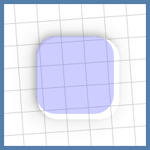

# Shadow Gadgets

A utility library for Android with various tools to help fix the elevation shadow artifacts visible on `View`s and `Composable`s with transparent or translucent backgrounds.


Those artifacts are a result of the hardware-accelerated shadows that came with the introduction of Material Design in Lollipop. The shadow gradient is left unclipped everywhere, presumably as a performance consideration.

These tools use the same classes and methods that the platform uses to render shadows, simply replacing the originals with clipped copies.


The latest (pre-)release also introduces a new compat functionality that can add color to shadows on API levels before 28, when shadow colors were first added to the SDK.

<br />


## **Contents**

### Views

+ [**Basic usage**](#basic-usage)

    Enabling the fix is as easy as setting a single `View` extension property, but the method used to accomplish this effect has an inherent limitation in certain setups.

+ [**Limitations and recourses**](#limitations-and-recourses)

    Android's continuing lockdown on reflection makes irregular shapes a bit of a problem on R+, but the only real Achilles' heel to the overall technique is overlapping sibling `View`s.

+ [**Color compat**](#color-compat)

    This new feature brings an option to add color to shadows on older API levels. This can be used independently of the clip setting, and will provide a slightly more performant implementation if no clipping is needed.

+ [**ViewGroups**](#viewgroups)

    The library offers a few customized Recycling `ViewGroup`s that are optimized for handling these shadows on all of their children, and several Regular ones that are mainly meant to allow the shadow properties to be set on their children from corresponding attributes in layout XML.

+ [**Drawable**](#drawable)

    A relatively simple `Drawable` class is provided to create independent shadows. This may be useful as another fix option, or even as a design element on its own.

### Compose

+ [**Experimental**](#experimental)

    The new color compat options require opt-in.

+ [**Modifier.clippedShadow()**](#modifierclippedshadow)

    The Compose version of this fix is singular and straightforward, since shadows can already be handled as separate and directly manipulable components in this framework. An overload has been added for this function to accommodate the new color compat options.

+ [**Modifier.shadowCompat()**](#modifiershadowcompat)

    This provides the lower-overhead option for color compat on Compose, for those setups where the shadows don't need to be clipped.

### General

+ [**Notes**](#notes)

    General notes, caveats, etc.

+ [**Download**](#download)

    Available through JitPack.

<br />


## **Views**

## Basic usage

Nobody wants to mess with a whole library for such a small thing that should've already been handled in the native UI framework, so this was designed to be as simple and familiar as possible:

```kotlin
view.clipOutlineShadow = true
```

That's it. Unless your setup requires that a _sibling_ `View` overlap a target of the fix, or it involves a target with an irregular shape on Android R and above, that's possibly all you need.

The `Boolean`-value `clipOutlineShadow` extension property is basically a switch to toggle the fix on `View`s individually, and it's designed to mimic an intrinsic property as much as possible. Though the shadow is actually being handled and drawn in the parent `ViewGroup`, the property can be set on the target `View` at any time, even while it's unattached, so there's no need to worry about timing. Additionally, the clipped shadow automatically animates and transforms along with its target, and it will handle moving itself to any new parents, should the target be moved.

It is hoped that that simple usage should cover most cases, but for the situations mentioned above, the library offers a few configuration properties as possible recourses.

<br />


## Limitations and recourses

### Overlapping sibling Views

The main limitation is inherent to the technique used, which was chosen because it allows the fix to be externally applied to any `View` without having to modify it or its existing setup. That method is basically to disable the target's built-in shadow and draw a clipped copy either in front of or behind it. Since the shadow is essentially pulled out of the normal draw routine, it's possible to end up with different kinds of artifacts than those which we're trying to fix.


On the left, the red target has a lower elevation than its plain, gray sibling, but the default `Foreground` plane draws in front of everything. On the right, the red target is higher than the gray sibling, but its `Background` shadow draws behind all of the child `View`s.

It is important to note that this is an issue only for _siblings_ of the target. `View`s in separate parent `ViewGroup`s have separate draws and won't interfere with each other. Indeed, in some cases the most straightforward solution is to simply wrap a target or sibling in another `ViewGroup`, like a plain old `FrameLayout`. There are certainly cases where siblings must overlap, however, hence the next core property and its corresponding enum class.

#### ShadowPlane
```kotlin
enum class ShadowPlane { Foreground, Background, Inline }
```

_NB: This enum was originally named `ClippedShadowPlane`, and the extension property `View.clippedShadowPlane`. Both are now deprecated and replaced in order to convey the fact that this feature works with the new color compat properties, with or without the clip active. `ClippedShadowPlane` is currently a `typealias` for `ShadowPlane`, and the property currently delegates to `View.shadowPlane`, but both will eventually be removed from the library altogether._

```kotlin
var View.shadowPlane: ShadowPlane
```

The `ShadowPlane` determines where exactly the shadow draw is inserted into the hierarchy's routine:

+ `Foreground` draws in the overlay of the target's parent `ViewGroup`, after all of the children. It is the default.

+ The `Background` plane draws behind the parent's content, immediately after its background drawable. All shadows in this plane are always clipped to their parents' bounds.

+ The new `Inline` type is drawn right along with the target itself, and is most similar in behavior and appearance to the regular shadows, but it has some additional requirements and caveats, which is why it's not the default option.

For example, the setups from the images above fixed:


On the left, we've set `redView.shadowPlane = Background`, moving the shadow draw to the back. The setup on the right was fixed by letting it draw to the `Foreground` plane, which is the default.

The new `Inline` plane would fix both situations:


Though `Inline` shadows seem to be the most appropriate overall solution, they behave a bit differently than the others, and have additional external requirements in order to function correctly.

+ **Non-library parents:** Since it's drawn along with the target `View` itself, an `Inline` shadow will work inside non-library parent `ViewGroup`s _only_ if the target `View` is not being clipped by anything else. Specifically:

    + The parent `ViewGroup` must have `clipChildren` set to `false`. The default value is `true`, so this has to be set manually in pretty much any `ViewGroup`.

    + The target `View` itself must have `clipToOutline` set to `false`, which is the default value for the `View` class, but certain subclasses enable it internally; e.g., `CardView` and its variants.

    If either of those is `true` when the shadow is created, its draw is disabled since it would be mostly or completely invisible, which is one of the main reasons that `Inline` is not the default. There is a rather explicit warning log, though, if one of these shadows is used in such a setup.

    Due to variations in the underlying graphics stuff between Android versions, `Inline` shadows in non-library parents on API levels 24 through 28 (Nougat, Oreo, and Pie) are always clipped to the parent's bounds. This is because even plain black shadows on those versions require a compositing layer in order to properly draw here. The ramifications of this are covered in the [Performance and overhead](#performance-and-overhead) section for color compat.

+ **Library parents:** If an `Inline` shadow is on a target that is a child of one of the library's `ShadowsViewGroup`s (and, for now, the `ClippedShadowsViewGroup`s), the `clipChildren` and `clipToOutline` settings are not necessary, as the draw can be handed off to the parent where it's inserted before those child clip operations happen.

    However, to be able to insert these draws between children, `ShadowsViewGroup`s have to manually reorder the child draws, which adds a tiny bit of overhead and prevents some of the low-level optimizations that hardware-acceleration brought in the first place. This special behavior simply offers another possible fix option for particular setups and requirements.

    By default, the Regular `ShadowsViewGroup`s will automatically take over any child `Inline` shadow draw; the Recycling groups do not. The `ignoreInlineChildShadows` property and corresponding XML attribute are available to change those defaults, but only before the group first attaches to the hierarchy, as explained in the ViewGroups [Behavior](#behavior) section. If a `ShadowsViewGroup` has `ignoreInlineChildShadows` set to `true`, it acts like a non-library parent and requires the `clipChildren` and `clipToOutline` settings mentioned.

The demo app has [a page](/demo/src/main/java/com/zedalpha/shadowgadgets/demo/topic/PlaneTopic.kt) that shows all three planes in use in both an interactive and a static setup.

### Irregular shapes on Android R+

The other notable limitation comes on Android R and above, when calculating the clip `Path` for `View`s with irregular shapes; i.e., `View`s that aren't rectangles, regular round rectangles, or circles. Reflection is required to get at the `Path` that describes those irregular shapes, and the increasing restrictions on non-SDK interfaces have finally made that field inaccessible. For these cases, the library has a `ViewPathProvider` interface that works very similarly to the framework's `ViewOutlineProvider` class, allowing the user to set the necessary `Path`. For example:

```kotlin
@RequiresApi(30)
class PuzzlePieceView constructor(
    context: Context,
    attrs: AttributeSet? = null
) : View(context, attrs) {

    private val viewPath = Path()

    private val paint = Paint(Paint.ANTI_ALIAS_FLAG)

    init {
        outlineProvider = object : ViewOutlineProvider() {
            override fun getOutline(view: View, outline: Outline) {
                val sideLength = minOf(view.width, view.height).toFloat()
                viewPath.setToPuzzlePiece(sideLength)
                outline.setPath(viewPath)
            }
        }
        pathProvider = ViewPathProvider { _, path ->
            path.set(viewPath)
        }
        clipOutlineShadow = true

        paint.color = Color.argb(64, 0, 0, 255)
        outlineAmbientShadowColor = Color.BLUE
        outlineSpotShadowColor = Color.BLUE
        elevation = 15F
    }

    override fun onDraw(canvas: Canvas) {
        canvas.drawPath(viewPath, paint)
    }
}
```

The `setToPuzzlePiece()` function is available in the `demo` module, if you'd like a full working example to play around with ([link](/demo/src/main/java/com/zedalpha/shadowgadgets/demo/topic/DrawableTopic.kt#L101)). Give it a non-zero width and height, and it'll produce something like:


Do note that the `ViewPathProvider` is a fallback, not an override. It will only be checked if the library is unable to determine the `Path` on its own. If a non-empty `Path` cannot be resolved – with or without a `ViewPathProvider` – then a shadow simply won't be drawn.

Also included in the library is the `MaterialComponentsViewPathProvider` object, a concrete implementation of this interface that will automatically handle figuring the `Path` on `View`s with a `MaterialShapeDrawable` background, which is how many modern library components get their overall shape and appearance.

```kotlin
shapedButton.pathProvider = MaterialComponentsViewPathProvider
```

This is a separate object that needs to be set manually so that `MaterialShapeDrawable` and related classes can be stripped at compile time, if they're not being used otherwise.

The demo app's [Irregular page](/demo/src/main/java/com/zedalpha/shadowgadgets/demo/topic/IrregularTopic.kt) has a demonstration of its use, as well as a more straightforward example of using `ViewPathProvider`.

### Parent matrix

For some reason, there are minor differences with some of the lower-level graphics stuff only on API levels 24 through 28 (Nougat, Oreo, and Pie). In certain situations, if a target's parent has a transformation applied to it, the target's shadow's clip area could go out of sync. That is, if the parent (or any ancestor, actually) is being scaled for an animation, say, the target, as its child, is scaled too, and sometimes the clip region won't line up anymore:



That's from the simple scale-down animation used as a drag-start indicator on the Intro page in the demo app, and it's been possible this whole time, unfortunately. That particular image is from a Nougat 7.0 emulator, and that's the only version on which I observed that particular defect in that particular setup, but it seems to be possible on any version from 24 through 28, though I've not yet pinned down exactly what causes it.

One way to mitigate it is to force the shadow draw to go through a layer, almost like it's being composited for color compat, but without the tint filter. The current method to do that is with another `View` extension property:

```kotlin
var View.forceShadowLayer: Boolean
```

Note that this is a passive flag. That is, changing its value while a shadow is active will _not_ trigger an update to that shadow instance. This value should be set at the very start. For example, I've amended the [Intro page setup](/demo/src/main/java/com/zedalpha/shadowgadgets/demo/topic/IntroTopic.kt#L50) to enable that flag for those problematic versions.

Since I'm uncertain of the root cause, I can't point out any specifics to avoid or ensure; all I can suggest is to test thoroughly if you want to try to use clipped shadows inside animated parents on those versions.

<br />


## Color compat

The library now offers a mechanism by which to add color to shadows on older versions, as the native colors – `outlineAmbientShadowColor` and `outlineSpotShadowColor` – were not added to the SDK until Pie (API level 28). The new `View.outlineShadowColorCompat` extension property can be used to set a color with which to tint shadows on versions before Pie, and its companion property `View.forceOutlineShadowColorCompat` is available to force this method to be used on newer versions as well, for the purposes of consistency, comparison, testing, etc.

```kotlin
@get:ColorInt
@setparam:ColorInt
var View.outlineShadowColorCompat: Int

var View.forceOutlineShadowColorCompat: Boolean
```

Color compat shadows are always clipped to their parents' bounds, since they require a sized compositing layer.

If `forceOutlineShadowColorCompat` is set to `true` on a `View`, you should not modify its `outlineAmbientShadowColor` and `outlineSpotShadowColor` values afterward. For the tint to apply correctly, the native shadow needs to be pure black.

At the SDK level, it's only possible to tint the composited ambient and spot shadows as a whole rather than individually, hence the single color to replace the two native ones in later versions. As a convenience, the library includes a helper class that can be used to blend the ambient and spot colors for later versions into a single color for our compat functionality. Do note that this is completely optional; you can use whatever valid color you like with `outlineShadowColorCompat`.

```kotlin
class ShadowColorsBlender(context: Context)
```

This helper class uses the `Context`'s theme alphas for ambient and spot shadows to proportionally blend those colors into a single value to be used with `outlineShadowColorCompat`. The `Context` passed must have the relevant theme for the current `Window`, but that's only a concern if you've changed `android:ambientShadowAlpha` or `android:spotShadowAlpha` for a given `Activity` or `Dialog`.

The class has just two functions:

+ `fun blend(@ColorInt ambientColor: Int, @ColorInt spotColor: Int): Int` – Returns a `@ColorInt` calculated by blending the passed colors in proportion to their respective theme alphas. Unfortunately, this has to be called and set on the target `View` manually, since the native color properties and attributes didn't exist at all on older versions.

    Please note that the blending calculation is tuned to give decent results only if the `ambientColor` and `spotColor` themselves are opaque. I haven't yet wrapped my head around how to satisfactorily blend two "non-opaque" light sources with additional multiplying alphas.

+ `fun onConfigurationChanged()` – To be called from the corresponding method in your UI component; i.e., the `Activity`, `Fragment`, etc. This is only necessary if you've set different alpha values for different themes.

The demo app has three new pages at the end for the color compat functionality, [the first](/demo/src/main/java/com/zedalpha/shadowgadgets/demo/topic/compat/ViewIntroPanel.kt) of which has a setup showing a `View`'s native shadow with adjustable ambient and spot colors, compared to one that's tinted with a blend of the two as its color compat.

### Independent use

Color compat can be used on its own, in which case the intrinsic shadow is replaced with an unclipped instance that's more performant, but still displays the original artifact. Consequently, unclipped color compat shadows are restricted to the `Background` and `Inline` planes, where their draws will be covered by the targets'. Any such shadow that is set in the `Foreground` plane is automatically moved to the `Background` internally, since we definitely don't want it drawing in the `Foreground`, and the `Inline` plane has different behavior and requirements than the main two.

Also, to clarify, `ViewPathProvider` is only relevant to the `clipOutlineShadow` functionality. If you need only color compat, you don't have to worry about that at all.

### Performance and overhead

It should be noted that any kind of alpha compositing is always more expensive than a straight draw, and the mechanism used here is no different. Though the core clip functionality involves replacing an intrinsic property with additional external objects, a plain clipped shadow brings no more overhead than adding, say, one more regular `CardView` to your layout. Tinting these shadows, however, requires additional compositing layers, and therefore approximately doubles the cost for a single color compat shadow.

In an effort to bring that down somewhat, color layers are consolidated and shared where possible; namely, in the `Foreground` and `Background` planes. In each of those planes, the shadows are drawn together all at once, rather than interleaved between siblings, as with the `Inline` type. This allows the shadows in one of those planes to be sorted and grouped in such a way that all those tinted with the same color are drawn in single layer. This isn't possible with `Inline` ones, due to how the underlying native state behaves, so each and every inlined color compat shadow requires its own separate layer.

Admittedly, this feature was developed mainly just to see if it could be done, but the `View` version turned out seemingly as solid as the core clip routine, so I think it's not unreasonable to offer it here and let the user decide if the overhead is acceptable for their setup. Great pains were taken to ensure that this optional feature does not interfere with or degrade the core fix in any way, and there should be no discernible decline in the behavior or performance of the plain clipped shadows.

The [last page](/demo/src/main/java/com/zedalpha/shadowgadgets/demo/topic/compat/CompatStressTestTopic.kt) in the demo app is a "stress test" for color compat that has a couple of setups that are, I would imagine, about as "worst-case" as it should get in your average app. The various relevant tools in Developer options – e.g., [Profile GPU/HWUI rendering](https://developer.android.com/topic/performance/rendering/inspect-gpu-rendering#enable_rendering_profiler) – can give you an idea of how much more expensive color compat shadows are compared to ones that are only clipped.

<br />


## ViewGroups

There are two general categories of `ViewGroup`s: Recycling and Regular. Their primary function is to act as helpers that can automatically set shadow properties on their children from attributes in layout XML. They can also be created programmatically, but the automatic setting behavior only works during initialization, as explained below in [Behavior](#behavior).

The Recycling groups also implement special behavior to maintain their children's shadows across the repeated detach/reattach cycles that happen while scrolling, preventing the shadows from constantly disposing of themselves only to be immediately recreated. Additionally, with the introduction of the `Inline` plane, all of the groups are able to take over their child shadows' draws, allowing them to be inlined without the clip setting restrictions that exist for non-library parents.

The current groups all implement the `ShadowsViewGroup` interface:

```kotlin
sealed interface ShadowsViewGroup {
    var clipAllChildShadows: Boolean
    var childShadowsPlane: ShadowPlane
    var childOutlineShadowsColorCompat: Int
    var forceChildOutlineShadowsColorCompat: Boolean
    var ignoreInlineChildShadows: Boolean
}
```

Each property has a corresponding XML attribute with the exact same name, and takes the values that you would expect. The first four are conveniences for setting a single value on all of the group's children. The last one is a flag to disable the group's takeover of `Inline` shadow draws, as it causes the native child draw routine to be altered a bit, and is best avoided in certain situations.

`ShadowsViewGroup` is a replacement for the previous `ClippedShadowsViewGroup`, which is now deprecated. In order to deprecate all of the old groups without breaking things, `ShadowsViewGroup` currently extends `ClippedShadowsViewGroup`, and all of the concrete implementations are likewise arranged; e.g., `ShadowsFrameLayout` extends `ClippedShadowsFrameLayout`.

The library currently includes the deprecated predecessors for all of Recycling and Regular groups mentioned in the following sections. They all have the same names as the newer ones simply prepended with `Clipped`; e.g., `ClippedShadowsRecyclerView`. They all behave exactly the same as the previous ones, but the old `Clipped` versions lack the color compat properties, and they will eventually be removed from the library altogether.

The demo app's [Application page](/demo/src/main/java/com/zedalpha/shadowgadgets/demo/topic/ApplicationTopic.kt) has an example of both Recycling and Regular groups.


### Behavior

To help prevent confusion about the runtime behavior, all of the group properties mentioned above are only really applicable during initialization; e.g., during XML layout inflation, or in code from `onCreate()`. The same is true for the child XML attributes that Regular groups handle, discussed below. Children added to a `ShadowsViewGroup` after the group has first attached to a `Window` will not have any shadow properties set automatically, and the values of the group's properties can no longer be changed. (This isn't completely accurate for Recycling groups, since they need to generate and add their children after they themselves have attached, but I think you get my point.)


### Recycling ViewGroups

By default, the library's shadow objects dispose of themselves whenever the target `View` is detached from the hierarchy. Since Recycling `ViewGroup`s continually detach and reattach their children during scroll events, this would cause some rather inefficient handling with the default behavior. To that end, the library offers these customized Recycling `ViewGroup` subclasses that are optimized for shadows on all of their children:

+ `ShadowsRecyclerView`
+ `ShadowsListView`
+ `ShadowsExpandableListView`
+ `ShadowsGridView`
+ `ShadowsStackView`

These are all located in the `com.zedalpha.shadowgadgets.view.viewgroup` package. Each implements the `ShadowsViewGroup` interface but otherwise behaves exactly like its base `ViewGroup`, and is a drop-in replacement in both code and XML. For example:

```xml
<com.zedalpha.shadowgadgets.view.viewgroup.ShadowsRecyclerView
    android:id="@+id/recycler_view"
    android:layout_width="match_parent"
    android:layout_height="match_parent"
    … />
```

By default, the Recycling groups all set `clipOutlineShadow = true` on each of their children, because that was their original and only feature. If you're using a Recycling group for only the color compat without the clip, you'll want to disable the default behavior by setting `app:clipAllChildShadows="false"` on the group in XML, or with the corresponding property in code. If you need to set shadow properties on the children individually, that can be done in the `Adapter`.

Additionally, Recycling groups do _not_ take over `Inline` shadow draws for their children by default – i.e., `ignoreInlineChildShadows == true`. A group taking over draws involves modifying the normal child routine a bit, and we'd like to avoid that for groups that need to redraw rapidly while scrolling. Their most common uses usually don't involve setups which would necessitate using that plane anyway. If you do need a Recycling group to handle those `Inline` draws – e.g., in a `ShadowsStackView` full of overlapping `CardView`s – you can enable it by setting `app:ignoreInlineChildShadows="false"` on the group in XML, or with the corresponding property in code.


### Regular ViewGroups

The Regular groups have all of the same library properties as the Recycling ones. However, they _do_ take over `Inline` child shadow draws by default – i.e., `ignoreInlineChildShadows == false` – so that the `clipChildren` and `clipToOutline` settings discussed in [the `ShadowPlane` section](#shadowplane) are not required. It seems preferable to have everything working out of the box with this type, since individual shadows going missing unexpectedly can be hard to diagnose in the editor and during test runs.

The main upshot of the Regular ones, though, is that they can recognize certain library attributes on their children in XML, so that you can set values for these properties in your layout, and they will be automatically applied during inflation without any extra code needed.

+ `app:shadowPlane`
+ `app:clipOutlineShadow`
+ `app:outlineShadowColorCompat`
+ `app:forceOutlineShadowColorCompat`

The XML values for each correspond to the code values just as you would expect. For example:

```xml
<com.zedalpha.shadowgadgets.view.viewgroup.ShadowsFrameLayout
    xmlns:android="http://schemas.android.com/apk/res/android"
    xmlns:app="http://schemas.android.com/apk/res-auto"
    …
    app:ignoreInlineChildShadows="true">

    <Button
        android:id="@+id/translucent_button"
        …
        app:shadowPlane="inline"
        app:clipOutlineShadow="true"
        app:outlineShadowColorCompat="#FF0000"
        app:forceOutlineShadowColorCompat="true" />

</com.zedalpha.shadowgadgets.view.viewgroup.ShadowsFrameLayout>
```

For the purposes of consistent behavior across all of the different `ViewGroup` types, these attributes will work properly only on `View`s with IDs that are unique within the `ViewGroup`. They are ignored on children that do not have an `android:id`.

The following comprise the full list of Regular `ShadowsViewGroup`s:

+ `ShadowsChipGroup`
+ `ShadowsConstraintLayout`
+ `ShadowsCoordinatorLayout`
+ `ShadowsFrameLayout`
+ `ShadowsLinearLayout`
+ `ShadowsMaterialButtonToggleGroup`
+ `ShadowsMotionLayout`
+ `ShadowsRadioGroup`
+ `ShadowsRelativeLayout`

As with the Recycling groups, they all implement `ShadowsViewGroup` and are located in `com.zedalpha.shadowgadgets.view.viewgroup`. Each is a drop-in replacement for the base `ViewGroup` in both code and XML.

<br />


## Drawable

As with the other `Clipped` components, `ClippedShadowDrawable` is now deprecated, replaced with `ShadowDrawable` located in the `drawable` subpackage. Like the other tools, the drawable has been updated and renamed to support color compat, which is realized here with a simple `var colorCompat: Int` property. Its default value is black – specifically, `#FF000000` – and if you set any other value, the color compat mechanism takes over to tint the shadow manually, ignoring the `ambientColor` and `spotColor` values.

The drawable now includes a constructor parameter to choose between clipped or unclipped versions, for the same reason that an unclipped `View` option is offered: to skip the potentially expensive clip operation if you're going to draw over that area anyway.

`ShadowDrawable` is essentially a very thin wrapper around the core classes used to draw these shadows in the other tools. It's provided mainly as a convenience for those who would like to be able to draw these manually without having to mess with the `core` module directly. It requires a hardware-accelerated `Canvas` to work, as do all of the tools, and there are a few ways in which it does not act like a regular `Drawable`.

### Invalidation

The most important caveat here is that you are responsible for invalidating the drawable anytime a relevant property changes. That is, if you change its rotation, for example, you need to invalidate the current draw. If the drawable's callback is set appropriately - e.g., like it would be when acting as a `View`'s background – then you likely need only to call `invalidateSelf()` on it. Otherwise, you'll need to `invalidate()` the `View` you're drawing in, or perform the analogous action in whatever context you're in.

Depending on the current internal configuration, the drawable could simply not redraw at all until you invalidate, or you could possibly end up with a worse artifact than the clip is meant to fix, if the draw goes out of sync while that's in use.

The demo app has [a Drawable page](/demo/src/main/java/com/zedalpha/shadowgadgets/demo/topic/DrawableTopic.kt) that demonstrates this defect.

### Bounds

The drawable's bounds do not affect the size, shape, or location of the shadow draw at all. Those are set initially from the `Outline`, and then modified with the relevant functions and properties; i.e., `setPosition()`, `translationX`, `scaleY`, etc. The bounds do set the extent of the compositing layer however, if one is in use, and must be set so that the shadow lies completely within them.

A compositing layer is necessary any time the `colorCompat` value is set to any color that's not black and not transparent. Also, due to platform variations, a layer is necessary for even default black shadows on API levels 24 through 28, so the bounds warning applies for all colors on those versions.

If you intend to use `colorCompat`, you must use the constructor that takes a `View`, and it must be one that is attached to the on-screen hierarchy; usually, just the one you're drawing in. If one is not provided, no tint will be applied, and the shadow will simply draw in the default black.

`Drawable`'s required `setColorFilter()` override is a no-op.

### Disposal

It is rather important to `dispose()` of these drawables when appropriate – e.g., in a `Fragment`'s `onDestroyView()`. This is technically not necessary if the drawable was created with the `@RequiresApi(29)` constructor that doesn't take a `View`, but it is still safe to call `dispose()` on those instances. Use after disposal is not an automatic `Exception` but it's not advised, and there is no guaranteed behavior.

The [second color compat page](/demo/src/main/java/com/zedalpha/shadowgadgets/demo/topic/compat/CompatDrawableTopic.kt) in the demo app shows an example drawable that's been customized to automatically center, along with some controls to fiddle with the color and rotation and such.

<br />


## **Compose**

## Experimental

Color compat in Compose currently requires `@OptIn`, as it still needs some improvements and fine-tuning. Additionally, color compat here is currently accomplished similarly to how `Inline` shadows are handled for Views, meaning the same internal requirements and overhead apply to this. Please refer to [the Performance and overhead section](#performance-and-overhead) for Views.

The [last page](/demo/src/main/java/com/zedalpha/shadowgadgets/demo/topic/compat/CompatStressTestTopic.kt) in the demo app has a stress test setup for Compose that's visually identical to the one for Views, apart from some minor irrelevant color variations, so you can compare them side by side.

## Modifier.clippedShadow()

`clippedShadow()` behaves just like `shadow()`, and the base function has the exact same signature:

```kotlin
fun Modifier.clippedShadow(
    elevation: Dp,
    shape: Shape = RectangleShape,
    clip: Boolean = elevation > 0.dp,
    ambientColor: Color = DefaultShadowColor,
    spotColor: Color = DefaultShadowColor
)
```

Please note that the `clip` parameter has nothing to do with the clipped shadow itself. That parameter means the same thing as it does for `shadow()`: "When active, the content drawing clips to the shape."

If you're using this to replace the shadow on an existing `@Composable`, you'll need to ensure that its intrinsic shadow is disabled, if it has one, by zeroing its elevation. For example:

```kotlin
Card(
    backgroundColor = Color.Transparent,
    elevation = 0.dp,
    shape = RoundedCornerShape(15.dp),
    modifier = Modifier
        .size(100.dp)
        .clippedShadow(
            elevation = 10.dp,
            shape = RoundedCornerShape(15.dp)
        )
) {}
```

The demo app has a few examples on [the Compose page](/demo/src/main/java/com/zedalpha/shadowgadgets/demo/topic/ComposeTopic.kt) that show how to replace the shadows on existing `Composable`s that animate their elevations without having to rewrite them or fiddle with their internals.

Color compat has been added to `clippedShadow()` with an overload:

```kotlin
fun Modifier.clippedShadow(
    elevation: Dp,
    shape: Shape = RectangleShape,
    clip: Boolean = elevation > 0.dp,
    ambientColor: Color = DefaultShadowColor,
    spotColor: Color = DefaultShadowColor,
    colorCompat: Color? = DefaultShadowColor,
    forceColorCompat: Boolean = false
)
```

`forceColorCompat` acts like the corresponding `View` property to force the compat mechanism to be used on API levels >= 28, for testing and comparisons and whatnot.

The `colorCompat` parameter defaults to black, but is also nullable to allow a special behavior that's described in the next section.

## Modifier.shadowCompat()

This one is for use when you only need the color compat functionality without the clip, in order to save some overhead:

```kotlin
fun Modifier.shadowCompat(
    elevation: Dp,
    shape: Shape = RectangleShape,
    clip: Boolean = elevation > 0.dp,
    ambientColor: Color = DefaultShadowColor,
    spotColor: Color = DefaultShadowColor,
    colorCompat: Color? = null,
    forceColorCompat: Boolean = false
)
```

It has the same parameter list as the `clippedShadow()` overload, but here `colorCompat`'s default value is null, which causes it to be automatically calculated as a blend of the supplied `ambientColor` and `spotColor`, in the same manner as described for `ShadowColorsBlender` in [the Color compat section](#color-compat) above. A separate helper object is not necessary here, though, since the ambient and spot are always supplied and simply ignored on older versions, where we can use them to figure our stand-in color. You can disable this behavior by simply providing any non-null value for `colorCompat`.

The [first color compat page](/demo/src/main/java/com/zedalpha/shadowgadgets/demo/topic/compat/ComposeIntroPanel.kt) in the demo app is set up to demonstrate these unclipped, tinted shadows with automatic color blending alongside the analogous View version.

<br />


## **General**

## Notes

+ [2.2.0-beta](https://github.com/zed-alpha/shadow-gadgets/releases/tag/2.2.0-beta) has been marked as a pre-release, so it doesn't show in the sidebar, apparently, even though it's listed at the top of [the Releases page](https://github.com/zed-alpha/shadow-gadgets/releases).

+ The actual documentation in the wiki is extremely out of date, and has been mostly unlinked from here until I can update it for the current API. Until then, this too-long README and the examples in the demo module will have to serve as ad hoc docs.

+ The bug with `Inline` shadows in non-library parents that was previously noted above has been resolved. However, due to variations in the platform, such shadows on those versions require a layer and will always be clipped to their parents' bounds.

+ The clip area for clipped shadows has been inset on all sides by the slightest bit possible in order to address a couple of potential visual and internal issues. I'm not sure that the difference is really noticeable, even in the demo app with the alphas raised significantly, but if this change is going to be problematic, I'm happy to rework it as an optional setting. This is one of the reasons for the beta version of this release.

+ If you only need the fix for `View`s in a simple static setup or two – e.g., a basic `CardView` – you might prefer to put something together from the core techniques demonstrated in [this Stack Overflow answer](https://stackoverflow.com/a/70076301). The main benefits of this library are its additional features on top of those methods, like its automatic handling of target state and animations. If that core solution is sufficient, you probably don't want the overhead here.

+ The native ambient and spot shadow colors are supported on Pie and above, technically. They absolutely do work for Q+, but I cannot get the native shadow colors to work _at all_ on Pie itself, with or without this library involved. All of the relevant methods and attributes were introduced with that version, and the documentation indicates that they should work like normal, but none of the emulators I've tested on show anything but black shadows. The code is in place here for Pie, though, if it's somehow functional for other installations. The demo app's [Intro page](/demo/src/main/java/com/zedalpha/shadowgadgets/demo/topic/IntroTopic.kt) has a setup that lets you fiddle with the shadow color, so that could be used as a quick test, if you're curious. It is set up to fall back to the new color compat mechanism for API levels <28, but 28 itself uses the native ambient and spot colors.

+ To disable the target's inherent shadow, its `ViewOutlineProvider` is wrapped in a custom implementation. This has the possibility of breaking something if some function or component is expecting the `View` to have one of the static platform implementations; i.e., `ViewOutlineProvider.BACKGROUND`, `BOUNDS`, or `PADDED_BOUNDS`. This shouldn't cause a fatal error, or anything – it's no different than anything else that uses a custom `ViewOutlineProvider` – but you might need to rework some background drawables or the like.

    This also means that if you are using a custom `ViewOutlineProvider` of your own on a target, it should be set _before_ enabling the clipped shadow, or at least before the target `View` attaches to its `Window`.

+ To be able to draw the clipped shadows in the `Background` plane, the parent `ViewGroup` itself must have a non-null background. If it does not have one at the time that such a shadow is added, a special library `object` is set automatically. For efficiency, this is the only time it is checked, so you should _not_ set the parent's background to specifically `null` any time it has `Background` shadows active. Any other non-null value is perfectly fine, but otherwise, the clipped shadows in that plane may end up drawing on the wrong background, possibly disappearing completely.

+ The layout inflation helpers' description and demonstration have been wholly removed to the wiki ([link](https://github.com/zed-alpha/shadow-gadgets/wiki/Layout_Inflation_Reference)). They are a rather niche tool, unlikely of much use to others, and probably won't be updated any further, apart from possible minor maintenance.

+ The demo app was designed and tested on 1080x1920 xxhdpi devices and not much else, so things might not look that great on other configurations. Just a heads up.

<br />


## Download

The initial releases are available through JitPack. In the appropriate `repositories`, simply add their Maven URL:

```gradle
repositories {
    google()
    mavenCentral()
    maven { url "https://jitpack.io" }
}
```

then add a dependency for [the latest release](https://github.com/zed-alpha/shadow-gadgets/releases) of whichever module you need, `view` or `compose`:

```gradle
dependencies {
    …
    implementation 'com.github.zed-alpha.shadow-gadgets:view:[latest-release]'
    implementation 'com.github.zed-alpha.shadow-gadgets:compose:[latest-release]'
}
```

You can also get the `core` module directly, if you'd like, but I've not had time to put together any documentation or examples for it. If you've been using that, apologies for the constant changes. It should be relatively stable now.

<br />


## License

MIT License

Copyright (c) 2023 ZedAlpha

Permission is hereby granted, free of charge, to any person obtaining a copy of this software and
associated documentation files (the "Software"), to deal in the Software without restriction,
including without limitation the rights to use, copy, modify, merge, publish, distribute,
sublicense, and/or sell copies of the Software, and to permit persons to whom the Software is
furnished to do so, subject to the following conditions:

The above copyright notice and this permission notice shall be included in all copies or substantial
portions of the Software.

THE SOFTWARE IS PROVIDED "AS IS", WITHOUT WARRANTY OF ANY KIND, EXPRESS OR IMPLIED, INCLUDING BUT
NOT LIMITED TO THE WARRANTIES OF MERCHANTABILITY, FITNESS FOR A PARTICULAR PURPOSE AND
NONINFRINGEMENT. IN NO EVENT SHALL THE AUTHORS OR COPYRIGHT HOLDERS BE LIABLE FOR ANY CLAIM, DAMAGES
OR OTHER LIABILITY, WHETHER IN AN ACTION OF CONTRACT, TORT OR OTHERWISE, ARISING FROM, OUT OF OR IN
CONNECTION WITH THE SOFTWARE OR THE USE OR OTHER DEALINGS IN THE SOFTWARE.