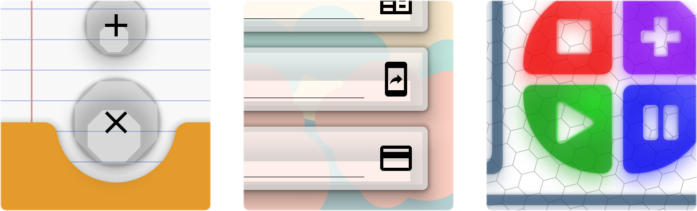
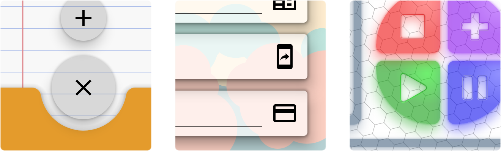
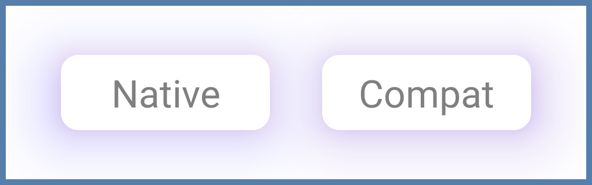
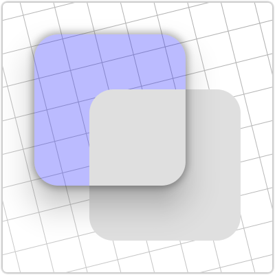
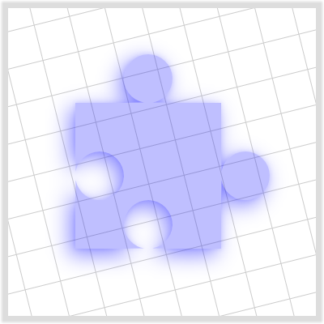
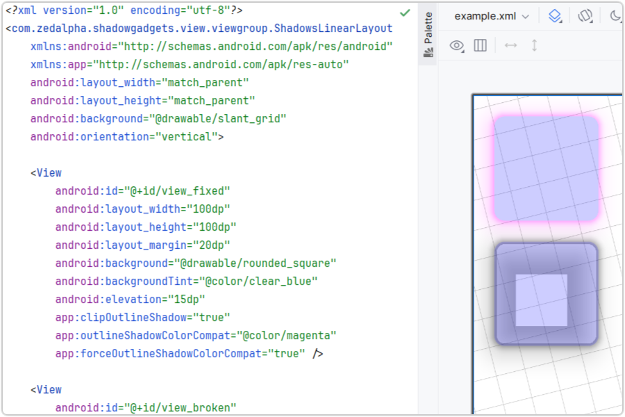

# Shadow Gadgets

A utility library for Android with various tools to help remedy a couple of
shortcomings in the native material shadows.

<br />

**Visual artifacts**

Unsightly draw defects are visible on `View`s and `Composable`s with see-through
backgrounds.

<!--suppress HtmlDeprecatedAttribute -->
<p align="center">
    <!--suppress CheckImageSize -->
    
</p>

The clip tools use the same classes and methods that the native framework uses
to render shadows, simply replacing the originals with clipped copies.

<!--suppress HtmlDeprecatedAttribute -->
<p align="center">
    <!--suppress CheckImageSize -->
    
</p>

**Color support**

Shadow colors were not added to the SDK until API level 28 (Pie). Before that,
the only relevant adjustment available was the alpha value of plain black.

Like the clip feature, color compat uses the same native classes and methods,
replacing the originals with tinted copies. Only one color can be applied with
this technique, however, as it's not possible to separate the ambient and spot
shadows at this level.

<!--suppress HtmlDeprecatedAttribute -->
<p align="center">
    <!--suppress CheckImageSize -->
    
</p>

Though the differences are noticeable when compared side by side, the compat
results are likely sufficient for many cases.

<br />

## Contents

- [**Views**](#views)

  The `view` package contains several extension properties and helper classes to
  apply the library's clip fix and color compat functionalities in Android's
  native framework.

- [**Compose**](#compose)

  For the analogous features in the modern UI toolkit, the `compose` package
  comprises just two functions (and one overload) as direct replacements for the
  inbuilt shadow.

- [**Notes**][Notes]

  Important information and caveats for each framework and the project overall.

- [**Download**](#download)

  Compiled artifacts are available through JitPack.

- [**Documentation ↗**][Documentation]

  Note that inherited members are suppressed to prevent, for example, all of
  `ViewGroup`s visible members being listed for each `ShadowsViewGroup`.

- [**Issues**][Issues]

  Please report bugs and any other problems encountered while using the library.

<br />

## Views

<details>
  <summary>Subsections</summary>

+ [Features](#features)
+ [Limitations and recourses](#limitations-and-recourses)
    + [Overlapping sibling Views](#overlapping-sibling-views)
    + [Irregular shapes on Android R+](#irregular-shapes-on-android-r)
+ [ViewGroups](#viewgroups)
+ [Drawable](#drawable)
</details>

<br />

### Features

The library's features are applied to individual `View`s through extension
properties, with the main two acting as direct controls for the clip and color
compat features.

- The [`View.clipOutlineShadow: Boolean`][clipOutlineShadow] extension is
  basically a switch that toggles the clip fix on the receiver `View`. When
  `true`, the intrinsic shadow is disabled and replaced with a clipped copy.

- The [`View.outlineShadowColorCompat: Int`][outlineShadowColorCompat] property
  takes a `@ColorInt` with which to tint replacement shadows on versions before
  Pie. A separate extension is available to force it on newer versions, and it
  can be used with or without the clip feature. The particulars can be found on
  [its wiki page][ViewColorCompatWiki].

Usage for each is as easy as it seems:

```kotlin
view.clipOutlineShadow = true

view.outlineShadowColorCompat = Color.BLUE
```

That's it. Unless your setup requires that a sibling `View` overlap a target of
the fix, or it involves a target with an irregular shape on Android R and above,
that's possibly all you need.

Though the library's shadow is actually being handled and drawn in the parent
`ViewGroup`, these properties can be set on the target `View` at any point, even
while it's unattached, so there's no need to worry about timing. Additionally,
the shadow automatically animates and transforms along with its target, and it
will handle moving itself to any new parents, should the target be moved.

It is hoped that the base features will cover most cases. For those setups that
might be problematic, the library offers a few other configuration properties as
possible remedies.

### Limitations and recourses

- #### Overlapping sibling Views

  To accomplish its effect, the library disables a target's intrinsic shadow and
  draws a modified replacement in its parent `ViewGroup`'s overlay by default,
  in front of all of the parent's children. This can cause a problem when a
  sibling with a higher elevation overlaps the target.

  <!--suppress HtmlDeprecatedAttribute -->
  <p align="center">
      <!--suppress CheckImageSize -->
      
  </p>

  The [`ShadowPlane`][ShadowPlane] enum defines other options for different
  points in the hierarchy's draw routine where the library shadow can be
  inserted. Specifics and requirements are given on [its wiki
  page][ShadowPlaneWiki].

- #### Irregular shapes on Android R+

  Starting with API level 30, `View`s that are not shaped as circles, plain
  rectangles, or single-radius rounded rectangles require that the user provide
  the outline `Path` for the clip.

  <!--suppress HtmlDeprecatedAttribute -->
  <p align="center">
      <!--suppress CheckImageSize -->
      
  </p>

  This is done with the [`ViewPathProvider`][ViewPathProvider] interface,
  details and examples for which are discussed on [its wiki
  page][ViewPathProviderWiki].

### ViewGroups

Several specialized subclasses of common `ViewGroup`s are included mainly as
helpers that allow shadow properties to be set on `View`s from attributes in
layout XML, without the need for extra code.

The library's features work rather well in Android Studio's layout preview, so
even if you don't intend to use them at runtime, these groups may still be
useful during design.

<!--suppress HtmlDeprecatedAttribute -->
<p align="center">
    <!--suppress CheckImageSize -->
    
</p>

Information on the two general types of groups – Regular and Recycling – along
with descriptions of their behaviors and usage in layout XML can be found on the
[ViewGroups wiki page][ViewGroupsWiki].

### Drawable

[`ShadowDrawable`][ShadowDrawable] is a thin wrapper around the core classes
that allows these shadows to be drawn manually without having to mess with the
`core` module. Information on requirements and usage, and links to examples can
be found on the [Drawable wiki page][DrawableWiki].

<br />

## Compose

> [!IMPORTANT]
> If you need only the clip fix in this one framework, you may not need to
> bother with this library at all. Recent improvements to Compose have made it
> possible to create a `Modifier` purely within the framework, and it might be
> preferable to simply copy the example given in
> <a href="https://stackoverflow.com/a/71868521">this Stack Overflow post</a>
> (or the one in
> <a href="https://gist.github.com/zed-alpha/50acf298881ebd112e6bfb934a30d0ba">
> the linked gist</a>, if supporting API levels 24..28).

Since Compose already allows shadows to be handled and manipulated as discrete
UI elements, employing the library's features here is straightforward and
routine.

The base [`clippedShadow`][clippedShadow] is a drop-in replacement for Compose's
[`shadow`][shadow] function, with the exact same signature and defaults, and
identical usage. For example:

```kotlin
Box(
    Modifier
        .clippedShadow(
            elevation = 10.dp,
            shape = CircleShape
        )
    …
)
```

Color compat is handled with additional parameters in an overload.

```kotlin
Box(
    Modifier
        .clippedShadow(
            elevation = 10.dp,
            shape = CircleShape,
            colorCompat = Color.Blue,
            forceColorCompat = true
        )
    …
)
```

For those cases where you need only color compat without the clip,
[`shadowCompat`][shadowCompat] is a more performant option.

```kotlin
Box(
    Modifier
        .shadowCompat(
            elevation = 10.dp,
            shape = CircleShape,
            ambientColor = Color.Blue,
            spotColor = Color.Cyan,
            colorCompat = Color.Blue
        )
    …
)
```

Details and examples for both functions can be found on the [Compose wiki
page][ComposeWiki].

<br />

## Download

The library is available as a compiled dependency through the very handy service
[JitPack][JitPack]. To enable download in a modern Gradle setup, add their Maven
URL to the `repositories` block inside the `dependencyResolutionManagement` in
the root project's `settings.gradle.kts` file; e.g.:

```kotlin
dependencyResolutionManagement {
    …
    repositories {
        …
        maven { url = uri("https://jitpack.io") }
    }
}
```

Then add a dependency for [the latest release][Releases] of whichever module is
required, `view` or `compose`:

```kotlin
dependencies {
    …
    implementation("com.github.zed-alpha.shadow-gadgets:view:[latest-release]")
    implementation("com.github.zed-alpha.shadow-gadgets:compose:[latest-release]")
}
```

<br />

## License

MIT License

Copyright (c) 2026 zed-alpha

Permission is hereby granted, free of charge, to any person obtaining a copy of
this software and associated documentation files (the "Software"), to deal in
the Software without restriction, including without limitation the rights to
use, copy, modify, merge, publish, distribute, sublicense, and/or sell copies of
the Software, and to permit persons to whom the Software is furnished to do so,
subject to the following conditions:

The above copyright notice and this permission notice shall be included in all
copies or substantial portions of the Software.

THE SOFTWARE IS PROVIDED "AS IS", WITHOUT WARRANTY OF ANY KIND, EXPRESS OR
IMPLIED, INCLUDING BUT NOT LIMITED TO THE WARRANTIES OF MERCHANTABILITY, FITNESS
FOR A PARTICULAR PURPOSE AND NONINFRINGEMENT. IN NO EVENT SHALL THE AUTHORS OR
COPYRIGHT HOLDERS BE LIABLE FOR ANY CLAIM, DAMAGES OR OTHER LIABILITY, WHETHER
IN AN ACTION OF CONTRACT, TORT OR OTHERWISE, ARISING FROM, OUT OF OR IN
CONNECTION WITH THE SOFTWARE OR THE USE OR OTHER DEALINGS IN THE SOFTWARE.


[Notes]: https://github.com/zed-alpha/shadow-gadgets/wiki/Notes
[Documentation]: https://zed-alpha.github.io/shadow-gadgets
[Issues]: https://github.com/zed-alpha/shadow-gadgets/issues
[clipOutlineShadow]: https://zed-alpha.github.io/shadow-gadgets/view/com.zedalpha.shadowgadgets.view/clip-outline-shadow.html
[outlineShadowColorCompat]: https://zed-alpha.github.io/shadow-gadgets/view/com.zedalpha.shadowgadgets.view/outline-shadow-color-compat.html
[ViewColorCompatWiki]: https://github.com/zed-alpha/shadow-gadgets/wiki/Color-compat
[ShadowPlane]: https://zed-alpha.github.io/shadow-gadgets/view/com.zedalpha.shadowgadgets.view/-shadow-plane/index.html
[ShadowPlaneWiki]: https://github.com/zed-alpha/shadow-gadgets/wiki/ShadowPlane
[ViewPathProvider]: https://zed-alpha.github.io/shadow-gadgets/view/com.zedalpha.shadowgadgets.view/-view-path-provider/index.html
[ViewPathProviderWiki]: https://github.com/zed-alpha/shadow-gadgets/wiki/ViewPathProvider
[ViewGroupsWiki]: https://github.com/zed-alpha/shadow-gadgets/wiki/ViewGroups
[ShadowDrawable]: https://zed-alpha.github.io/shadow-gadgets/view/com.zedalpha.shadowgadgets.view.drawable/-shadow-drawable/index.html
[DrawableWiki]: https://github.com/zed-alpha/shadow-gadgets/wiki/Drawable
[clippedShadow]: https://zed-alpha.github.io/shadow-gadgets/compose/com.zedalpha.shadowgadgets.compose/clipped-shadow.html
[shadow]: https://developer.android.com/reference/kotlin/androidx/compose/ui/Modifier#(androidx.compose.ui.Modifier).shadow(androidx.compose.ui.unit.Dp,androidx.compose.ui.graphics.Shape,kotlin.Boolean,androidx.compose.ui.graphics.Color,androidx.compose.ui.graphics.Color)
[shadowCompat]: https://zed-alpha.github.io/shadow-gadgets/compose/com.zedalpha.shadowgadgets.compose/shadow-compat.html
[ComposeWiki]: https://github.com/zed-alpha/shadow-gadgets/wiki/Compose
[JitPack]: https://jitpack.io/#zed-alpha/shadow-gadgets
[Releases]: https://github.com/zed-alpha/shadow-gadgets/releases