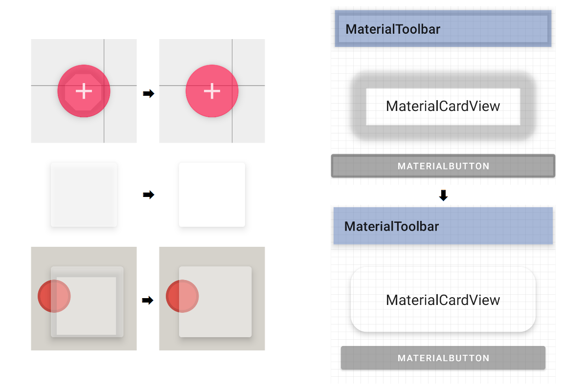

# Shadow Gadgets

A utility library for Android with various tools to fix the elevation shadow artifacts visible on `View`s<sup>*</sup> with transparent or translucent backgrounds.



Those particular artifacts are from the hardware-rendered shadows that came with the introduction of Material Design in Lollipop. This library does not affect any other kind of shadow.

## Download

The initial releases are available through the handy service JitPack. In the appropriate `repositories`, simply add their Maven URL:

```gradle
repositories {
    google()
    mavenCentral()
    maven { url "https://jitpack.io" }
}
```

then add a dependency for [the latest release](https://github.com/zed-alpha/shadow-gadgets/releases):

```gradle
dependencies {
    …
    implementation 'com.github.zed-alpha:shadow-gadgets:[latest-release]'
}
```

## Basic usage

The primary functionality is provided by a `Boolean`-value extension property on `View` called `clipOutlineShadow`, in keeping with similar platform method names. It's essentially a switch to toggle the fix on `View`s individually. For example:

```kotlin
if (!view.clipOutlineShadow) view.clipOutlineShadow = true
```

That's it. It behaves like any other such `View` property. The `if` check is strictly illustrative, and is not required before setting either value.

That's possibly all you need to know, if you only require this for a couple of `View`s, and you're able to add the few necessary lines to your code. The rest of this file mainly concerns setting up `LayoutInflater` helpers to set those properties automatically for various configurations. Please do consult [the Limitations and Notes below](#limitations), however, for caveats and possible conflicts.


## Adding to layout inflation

For more than a handful of `View`s, setting that property individually in code is tedious and bulky, so the library also offers a few ways to set it automatically by inserting a helper into the layout inflation pipeline. Since a standard setup these days often involves a Material Components theme on an `AppCompatActivity`, we'll use that one to illustrate the main points. The differences in usage for regular AppCompat themes, and for non-library `Activity` classes, follow the description of Tag Matchers, which are common to all three arrangements.


### Material Components Helper

The helper class for this version is `MaterialComponentsShadowHelper`, and it can be attached either through resources, or programmatically in the `Activity` itself.

+ #### Through resources

    In the relevant theme, this helper class is set as the `viewInflaterClass`.

    ```xml
    <style name="Theme.YourApp" parent="Theme.MaterialComponents…">
        …
        <!-- You can use either the fully qualified class name… -->
        <item name="viewInflaterClass">com.zedalpha.shadowgadgets.inflation.MaterialComponentsShadowHelper</item>

        <!-- Or, a string resource of that name is also provided, as a convenience. -->
        <item name="viewInflaterClass">@string/material_components_shadow_helper</item>
    </style>
    ```

+ #### Programmatically

    In code, the `attachMaterialComponentsShadowHelper()` extension function on `AppCompatActivity` simply sets that `viewInflaterClass` value dynamically, for the current `Activity` instance only. It must be called _before_ the `super.onCreate()` call.

    ```kotlin
    class MaterialComponentsActivity : AppCompatActivity(R.layout.activity_material_components) {
        override fun onCreate(savedInstanceState: Bundle?) {
            attachMaterialComponentsShadowHelper()
            super.onCreate(savedInstanceState)
            …
        }
    }
    ```

By default, the helper looks for any `View` tag with the `clipOutlineShadow` attribute set to `true`. For example:

```xml
<com.google.android.material.button.MaterialButton
    xmlns:app="http://schemas.android.com/apk/res-auto"
    android:id="@+id/translucent_button"
    …
    app:clipOutlineShadow="true" />
```


### Common: Tag Matchers

If you'd rather not modify layout files to add the `clipOutlineShadow` attribute, you can instead create `TagMatcher`s to select certain tags on which to enable the fix. These `TagMatcher`s can be defined in resource XML (`R.xml`) files, or in code.

+ #### In resource XML

    Standard matchers can be defined in XML files, with a very simple set of available elements and attributes. For example:

    ```xml
    <matchers
        xmlns:android="http://schemas.android.com/apk/res/android"
        xmlns:app="http://schemas.android.com/apk/res-auto">

        <id android:id="@id/translucent_button" />
        <id android:name="translucent_button" />
        <id android:name="translucent_" app:matchRule="startsWith" />
        <name android:name="Button" app:matchRule="endsWith" />
    </matchers>
    ```

    The parser is quite lenient and basically ignores everything except the `<id>` and `<name>` tags, and the `android:id`, `android:name`, and `app:matchRule` attributes. All of the example elements shown above will match the aforementioned `<com.google.android.material.button.MaterialButton>` tag.

    IDs can be matched either by exact reference with the normal syntax, as shown in the first `<id>` element, or by name with a string matching rule, as shown in the next two. The default rule is `equals` (which need not be specified) and the others are `contains`, `startsWith`, and `endsWith`.

    Name matchers are valid only with an `android:name` attribute. Similar to IDs the default rule is `equals`, and the other rules are all available for this, as well.

    The XML resource can be specified to the helper through resources either with the `shadowTagMatchers` theme attribute:

    ```xml
    <style name="Theme.YourApp" parent="Theme.MaterialComponents…">
        …
        <item name="viewInflaterClass">@string/material_components_shadow_helper</item>
        <item name="shadowTagMatchers">@xml/matchers</item>
    </style>
    ```

    Or with a `<meta-data>` element in the manifest:

    ```xml
    <application …>

        <activity
            android:name=".MaterialComponentsActivity"
            android:theme="@style/Theme.MaterialComponents…">
            <meta-data
                android:name="com.zedalpha.shadowgadgets.SHADOW_TAG_MATCHERS"
                android:resource="@xml/matchers" />
        </activity>

    </application>
    ```

    The helper first looks for the theme attribute to obtain the appropriate XML resource. If the attribute is not present, it will look for a `<meta-data>` tag in the `<activity>` element, and then for a `<meta-data>` in the `<application>` element.

+ #### Programmatically

    The `attachMaterialComponentsShadowHelper()` function has an overload that takes a `List<TagMatcher>`. The two standard matchers can be constructed at runtime with the `idMatcher()` and `nameMatcher()` functions. To demonstrate, the matchers from the XML resource above can be replicated in code like so:

    ```kotlin
    class MaterialComponentsActivity : AppCompatActivity(R.layout.activity_material_components) {
        override fun onCreate(savedInstanceState: Bundle?) {
            attachMaterialComponentsShadowHelper(
                listOf(
                    idMatcher(R.id.translucent_button),
                    idMatcher(matchName = "translucent_button"),
                    idMatcher(matchName = "translucent_", matchRule = MatchRule.StartsWith),
                    nameMatcher("Button", MatchRule.EndsWith)
                )
            )
            super.onCreate(savedInstanceState)
            …
        }
    }
    ```

    If you need further and/or different options for matching, `TagMatcher` is a simple `interface` that you can implement yourself.

    ```kotlin
    interface TagMatcher {
        fun matches(view: View, tagName: String, attrs: AttributeSet): Boolean
    }
    ```

    The first parameter is the `View` object inflated from the XML tag described by the subsequent two parameters. You must return `true` from `matches()` for the clip to be enabled automatically.

+ #### Hybrid

    Additionally, `attachMaterialComponentsShadowHelper()` has one more overload that takes an `R.xml` so you can construct the matchers list from XML at runtime, simply as another configuration option.

    ```kotlin
    class MaterialComponentsActivity : AppCompatActivity(R.layout.activity_material_components) {
        override fun onCreate(savedInstanceState: Bundle?) {
            attachMaterialComponentsShadowHelper(R.xml.matchers)
            super.onCreate(savedInstanceState)
            …
    ```

Though regular AppCompat themes and platform Activities require different helper classes than Material Components, these `TagMatcher` definitions and implementations are common to all three variations.


### AppCompat Helper

The only differences between this version and the Material Components one above are the names of the helper class and attach function. They are kept wholly separate mainly to allow those not using Material Components to have the pertinent components stripped at build time.

+ #### Through resources

    ```xml
    <style name="Theme.YourApp" parent="Theme.AppCompat…">
        …
        <!-- Either -->
        <item name="viewInflaterClass">com.zedalpha.shadowgadgets.inflation.AppCompatShadowHelper</item>

        <!-- Or -->
        <item name="viewInflaterClass">@string/appcompat_shadow_helper</item>
    </style>
    ```

+ #### Programmatically

    In code, the relevant function is named `attachAppCompatShadowHelper()` instead.

    ```kotlin
    class CompatActivity : AppCompatActivity(R.layout.activity_compat) {
        override fun onCreate(savedInstanceState: Bundle?) {
            attachAppCompatShadowHelper()
            super.onCreate(savedInstanceState)
            …
        }
    }
    ```

    It also must be called before the `super.onCreate()` call, and has available the same overloads as `attachMaterialComponentsHelper()`.


### Platform Helper

In code, using this with a platform `Activity` class is quite similar to the library setups, the analogous function named simply `attachShadowHelper()` in this case.

+ #### Programmatically

    ```kotlin
    class PlatformActivity : Activity() {
        override fun onCreate(savedInstanceState: Bundle?) {
            super.onCreate(savedInstanceState)
            attachShadowHelper()
            setContentView(R.layout.activity_platform)
            …
        }
    }
    ```

    Note, however, that the attach function is called immediately _after_ the `super.onCreate()` call this time, though still before the first call to `setContentView()`.

+ #### Through resources

    Unfortunately, there is no `viewInflaterClass` attribute in the platform; that is a feature of AppCompat (and therefore Material Components, as well). In order to be able to apply this externally, without needing to modify the `Activity` classes, the attach method can be called on the `Activity` instances as they're passed to an `ActivityLifecycleCallbacks` object registered in a custom `Application` class. For example:

    ```kotlin
    class ShadowHelperApplication : Application() {
        override fun onCreate() {
            super.onCreate()
            registerActivityLifecycleCallbacks(object : ActivityCreatedCallback {
                override fun onActivityCreated(activity: Activity, savedInstanceState: Bundle?) {
                    activity.attachShadowHelper()
                }
            })
        }
    }
    ```

    where `ActivityCreatedCallback` is an `interface` extending `ActivityLifecycleCallbacks` with empty defaults for the unused functions. This class unconditionally attaches the platform helper to every `Activity`. If that happens to be sufficient for your setup, `ShadowHelperApplication` is actually included in the library, and can be applied like any other custom `Application`.

    ```xml
    <application
        android:name="com.zedalpha.shadowgadgets.inflation.ShadowHelperApplication"
        … />
    ```

    If you need to alter that behavior, or to integrate this with an existing `Application` subclass, you can use `ShadowHelperApplication` as just an example, and `ActivityCreatedCallback` is also publicly available, as a convenience.


### Limitations

+ The main limitation is the one inherent to the current technique: target `View`s with overlapping siblings can cause glitches. The `clipOutlineShadow` extension is effectively disabling the target's inherent shadow and drawing a clipped replica onto its parent's overlay, which means that it's drawing on top of all of the children. If you really need things to overlap, you could wrap the target in another `ViewGroup` – like a `<FrameLayout>` – which would isolate its shadow draw, and is likely as efficient as the extra processing that would be necessary to handle that internally. I would imagine, though, that most use cases will be for separate, individual elements like are shown in the demo app.

+ The other one at the moment is that, starting with Android R, only `View`s with "regular" `Outline`s are automatically supported; i.e., `View`s that are circles, rectangles, or rounded rectangles with the same radius for all corners. The increasing restrictions on non-SDK interfaces that began in Pie have finally removed access to the `Path` object necessary for irregular shapes. A future release will have some alternate method for these newer versions.

+ Please refer to the demo app for comparative visuals of these limitations, as they are both illustrated on the last page of the Showcase section there.

### Notes

+ Colored shadows are now supported on Pie and above, technically. They absolutely do work for Q+, but I cannot get colors on shadows _at all_ on Pie, with or without this library involved. The documentation indicates that it should work, and all of the relevant methods and attributes are available starting with that version, but none of the emulators I've tested on show anything but black shadows. The code is in place here for Pie, though, if it somehow works for other installations. The demo app has a page for colors which would be a quick and easy test for that.

+ On the Lollipop versions, API levels 21 and 22, the fallback implementation that uses `View`s instead of `RenderNode`s, should the latter fail, has a minor bug in that a target `View` set to `INVISIBLE` or `GONE` while its shadow is clipped can cause an infinite invalidate loop, for as yet unknown reasons.

+ The AppCompat and Material Components inflation helpers are (obviously) set as the `viewInflaterClass` in their respective configurations. If you're using anything other than the default inflaters that are handled internally by `AppCompatActivity`, then you might need to adapt or modify the helpers here, or possibly forgo them altogether.

+ Forthcoming features:

    + Compose UI integration
    + Custom `ViewGroup` subclass, `ListView`, and `RecyclerView` optimizations

---

<sup><sup>*</sup> Compose UI suffers from the same issue, as it's ultimately using the same `RenderNode` APIs as regular `View`s. However, this library currently works only with the `View` framework. Compose UI integration is the first planned major update, if they haven't rolled their own separate shadow implementation by then, which I suspect they're planning. The platform shadows are rather limited.</sup>


## License

MIT License

Copyright (c) 2022 ZedAlpha

Permission is hereby granted, free of charge, to any person obtaining a copy of this software and
associated documentation files (the "Software"), to deal in the Software without restriction,
including without limitation the rights to use, copy, modify, merge, publish, distribute,
sublicense, and/or sell copies of the Software, and to permit persons to whom the Software is
furnished to do so, subject to the following conditions:

The above copyright notice and this permission notice shall be included in all copies or substantial
portions of the Software.

THE SOFTWARE IS PROVIDED "AS IS", WITHOUT WARRANTY OF ANY KIND, EXPRESS OR IMPLIED, INCLUDING BUT
NOT LIMITED TO THE WARRANTIES OF MERCHANTABILITY, FITNESS FOR A PARTICULAR PURPOSE AND
NONINFRINGEMENT. IN NO EVENT SHALL THE AUTHORS OR COPYRIGHT HOLDERS BE LIABLE FOR ANY CLAIM, DAMAGES
OR OTHER LIABILITY, WHETHER IN AN ACTION OF CONTRACT, TORT OR OTHERWISE, ARISING FROM, OUT OF OR IN
CONNECTION WITH THE SOFTWARE OR THE USE OR OTHER DEALINGS IN THE SOFTWARE.