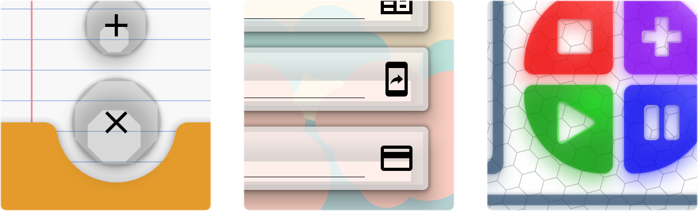
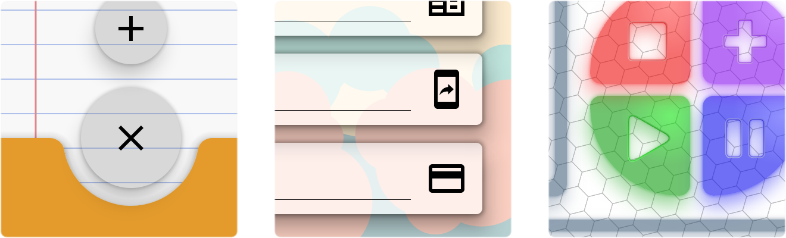
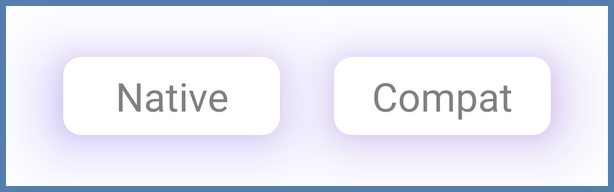
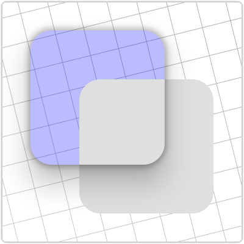
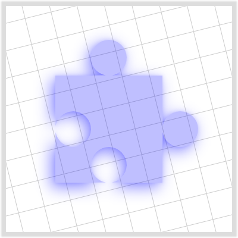
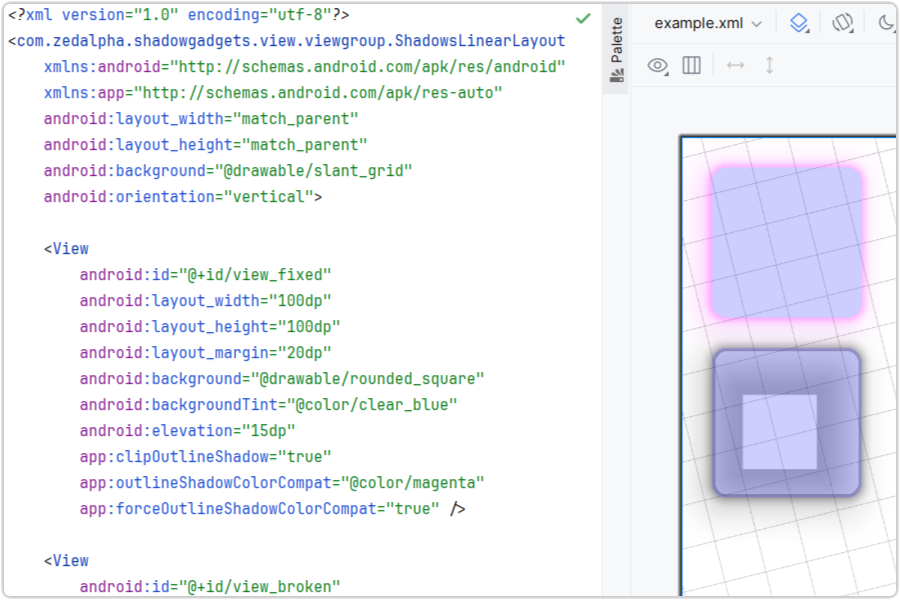

# Shadow Gadgets

A utility library for Android with various tools to help remedy shortcomings in
the shadow implementations for Views and Composables.

<br />

**Visual artifacts**

Unsightly draw defects in the native shadows are visible on elements with
see-through backgrounds.

<!--suppress HtmlDeprecatedAttribute -->
<p align="center">
    <!--suppress CheckImageSize -->
    
</p>

The clip tools use the same classes and methods that the framework uses to
render shadows, simply replacing the originals with clipped copies.

<!--suppress HtmlDeprecatedAttribute -->
<p align="center">
    <!--suppress CheckImageSize -->
    
</p>

This clip feature is also available for Compose's new drop shadow modifiers.

<br />

**Color support**

Shadow colors were not added to the native shadows until API level 28 (Pie).
Before that, the only relevant adjustment available was the alpha value of plain
black.

Like the clip feature, color compat uses the same native classes and methods,
replacing the originals with tinted copies. Only one color can be applied with
this technique, however, as it's not possible to separate the ambient and spot
shadows at this level.

<!--suppress HtmlDeprecatedAttribute -->
<p align="center">
    <!--suppress CheckImageSize -->
    
</p>

Though the differences are noticeable when compared side by side, the compat
results are likely sufficient for many cases.

<br />

## Contents

- [**Views**](#views)

  The `view` package contains several extension properties and helper classes to
  apply the library's clip fix and color compat functionalities in Android's
  native framework.

- [**Compose**](#compose)

  For the analogous features for native shadows in the modern UI toolkit, the
  `compose` package contains just two functions (plus overloads) as direct
  replacements for the inbuilt shadow.

  The clip feature is now available for drop shadows as well.

- [**Notes**][Notes]

  Important information and caveats for each framework and the project overall.

- [**Download**](#download)

  Compiled artifacts are available through JitPack.

- [**Documentation**<sup>↗</sup>][Documentation]

  Note that inherited members are suppressed to prevent, for example, all of
  `ViewGroup`'s visible members being listed for each `ShadowsViewGroup`.

- [**Issues**][Issues]

  Please report bugs and any other problems encountered while using the library.

<br />

## Views

<details>
  <summary>Subsections</summary>

- [Limitations and recourses](#limitations-and-recourses)
  - [Overlapping sibling Views](#overlapping-sibling-views)
  - [Irregular shapes on Android R+](#irregular-shapes-on-android-r)
- [ViewGroups](#viewgroups)
- [Drawable](#drawable)
- [Miscellanea](#miscellanea)
</details>

Nobody wants to mess with a whole library for such small issues that should've
been handled already in the native framework or supporting packages, so these
tools have been designed to be as simple and familiar as possible.

```kotlin
view.clipOutlineShadow = true
view.outlineShadowColorCompat = Color.BLUE
```

That's it. Unless your setup requires that a sibling `View` overlap a target of
the fix, or it involves a target with an irregular shape on Android R and above,
that's possibly all you need.

- The [`View.clipOutlineShadow: Boolean`][clipOutlineShadow] extension is simply
  a switch that toggles the clip fix on the receiver `View`. When `true`, the
  intrinsic shadow is disabled and replaced with a clipped copy.

- The [`View.outlineShadowColorCompat: Int`][outlineShadowColorCompat] property
  takes a `@ColorInt` with which to tint replacement shadows on versions before
  Pie. A separate extension is available to force it on newer versions, and it
  can be used with or without the clip feature. The particulars can be found on
  [its wiki page][ViewColorCompatWiki].

Though the library's shadow is actually being handled and drawn in the parent
`ViewGroup`, these properties can be set on the target `View` at any point, even
while it's unattached, so there's no need to worry about timing. Additionally,
the shadow automatically animates and transforms along with its target, and it
will handle moving itself to any new parents should the target be moved.

It is hoped that the base features will cover most cases. For those setups that
might be problematic, the library offers a couple of configuration properties as
potential remedies.

### Limitations and recourses

- #### Overlapping sibling Views

  To accomplish its effect, the library disables a target's intrinsic shadow and
  draws a modified replacement in its parent `ViewGroup`'s overlay by default,
  in front of all the children. This can cause a problem when a sibling with a
  higher elevation overlaps the target.

  <!--suppress HtmlDeprecatedAttribute -->
  <p align="center">
      <!--suppress CheckImageSize -->
      
  </p>

  The [`ShadowPlane`][ShadowPlane] enum defines other options for different
  points in the hierarchy's draw routine where the library shadow can be
  inserted. Specifics and requirements are given on [its wiki
  page][ShadowPlaneWiki].

- #### Irregular shapes on Android R+

  Starting with API level 30, `View`s that are not shaped as circles, plain
  rectangles, or single-radius rounded rectangles require that the user provide
  the outline `Path` for the clip.

  <!--suppress HtmlDeprecatedAttribute -->
  <p align="center">
      <!--suppress CheckImageSize -->
      
  </p>

  This is done with the [`ViewPathProvider`][ViewPathProvider] interface,
  details and examples for which are discussed on [its wiki
  page][ViewPathProviderWiki].

### ViewGroups

Several specialized subclasses of common `ViewGroup`s are included mainly as
helpers that allow shadow properties to be set on `View`s from attributes in
layout XML, without the need for extra code.

The library's features work rather well in Android Studio's layout preview, so
even if you don't intend to use them at runtime, these groups may still be
useful during design.

<!--suppress HtmlDeprecatedAttribute -->
<p align="center">
    <!--suppress CheckImageSize -->
    
</p>

Information on the two general types of groups – Regular and Recycling – along
with descriptions of their behaviors and usage in layout XML can be found on the
[ViewGroups wiki page][ViewGroupsWiki].

### Drawable

[`ShadowDrawable`][ShadowDrawable] is a thin wrapper around the core classes
that allows these shadows to be drawn manually. Information on requirements and
usage, and links to examples are available on the [Drawable wiki
page][DrawableWiki].

### Miscellanea

Aside from the main shadow tools, there are a handful of utilities to help with
applying, testing, and debugging library features.

- A [`ShadowGadgets`][ShadowGadgets] object holds a few flags for the active
  draw method, logs, and error handling. ([wiki page][ShadowGadgetsWiki])

- The [`ShadowException`][ShadowException] class has been added for known error
  states. There are about half a dozen, and all but one can be addressed with
  design-time alterations. ([wiki page][ShadowExceptionWiki])

- The [`ShadowMode`][ShadowMode] enum has been added along with `View`
  extensions to get the current mode and to set a change callback, meant mainly
  for runtime error handling. ([wiki page][ShadowModeWiki])

- Lastly, a couple of `View` extensions have been added to allow efficient
  modification of multiple shadow properties at once, helpful especially in
  recycling `Adapter`s. ([wiki page][ShadowUpdateWiki])

<br />

## Compose

<details>
  <summary>Subsections</summary>

- [Modifier.clippedShadow](#modifierclippedshadow) 
  - [Simple](#simple) 
  - [Color compat](#color-compat) 
  - [Lambda](#lambda)
- [Modifier.shadowCompat](#modifiershadowcompat)
  - [Simple](#simple-1)
  - [Lambda](#lambda-1)
- [Modifier.clippedDropShadow](#modifierclippeddropshadow)
  - [Simple](#simple-2)
  - [Lambda](#lambda-2)
</details>

Since Compose already allows shadows to be handled and manipulated as discrete
UI elements, employing the library's features here is straightforward and
routine.

There are two replacements for the inbuilt `shadow` modifier:
[`clippedShadow`][clippedShadow] and [`shadowCompat`][shadowCompat], the latter
being the more performant option when only color compat is needed.
([wiki page][ComposeNativeWiki])

The last modifier, [`clippedDropShadow`][clippedDropShadow], adds the clip
feature to the new `dropShadow` modifier, which has supported color from the
start, so no need for a compat version here. ([wiki page][ComposeDropWiki])

### Modifier.clippedShadow

- #### Simple

  The base [`clippedShadow`][clippedShadow] is a drop-in replacement for
  `shadow`, with the exact same signature and defaults, and identical
  usage. For example:

  ```kotlin
  Modifier
      .clippedShadow(
          elevation = 10.dp,
          shape = CircleShape,
          …
      )
  ```

- #### Color compat

  Color compat is handled here through parameters.

  ```kotlin
  Modifier
      .clippedShadow(
          elevation = 10.dp,
          shape = CircleShape,
          …
          colorCompat = Color.Blue,
          forceColorCompat = true
      )
  ```

- #### Lambda

  There is now also an overload that takes a lambda to allow for efficient
  updates of shadow properties without recomposition. This mimics the lambda
  version of `dropShadow`; elevation is in pixels rather than `Dp`, but the
  scope is a `Density` so conversions are trivial.

  ```kotlin
  Modifier
      .clippedShadow(shape = CircleShape) {
          elevation = animatedElevationDp.toPx()
          …
      }
  ```

### Modifier.shadowCompat

- #### Simple

  The [`shadowCompat`][shadowCompat] modifier is a more performant option for
  those cases where only color compat is needed.

  ```kotlin
  Modifier
      .shadowCompat(
          elevation = 10.dp,
          shape = CircleShape,
          ambientColor = Color.Blue,
          spotColor = Color.Cyan,
          colorCompat = Color.Blue
      )
  ```

- #### Lambda

  `shadowCompat` also has a lambda overload that is exactly like
  `clippedShadow`'s except for the name of its scope interface, which is itself
  otherwise identical.

  ```kotlin
  Modifier
      .shadowCompat(shape = CircleShape) {
          elevation = animatedElevationDp.toPx()
          colorCompat = animatedColor
          forceColorCompat = true
          …
      }
  ```

### Modifier.clippedDropShadow

- #### Simple

  The base [`clippedDropShadow`][clippedDropShadow] requires a `Shadow`
  instance, and is a drop-in replacement for the corresponding `dropShadow`
  overload.

  ```kotlin
  Modifier
      .clippedDropShadow(
          shape = CircleShape,
          shadow = Shadow(radius = 10.dp, color = Color.Blue)
      )
  ```

- #### Lambda

  This version allows for shadow property updates without recomposition. It is
  a drop-in replacement as well.

  ```kotlin
  Modifier
      .clippedDropShadow(shape = CircleShape) {
          radius = animatedElevationDp.toPx()
          color = animatedColor
          …
      }
  ```

<br />

## Download

> [!IMPORTANT]
> Remember to check [the Notes][Notes] for anything that might be relevant to
> your project.

The library is available as compiled dependencies through the very handy service
[JitPack][JitPack]. To enable download in a modern Gradle setup, add their Maven
URL to the `repositories` block inside the `dependencyResolutionManagement` in
the root project's `settings.gradle.kts` file; e.g.:

```kotlin
dependencyResolutionManagement {
    …
    repositories {
        …
        maven { url = uri("https://jitpack.io") }
    }
}
```

Then, add a dependency for [the latest release][Releases] of each required
module, directly, or through your `libs.versions.toml`:

```kotlin
dependencies {
    …
    implementation("com.github.zed-alpha.shadow-gadgets:view:[latest-release]")
    implementation("com.github.zed-alpha.shadow-gadgets:compose:[latest-release]")
}
```

<br />

<br />

## License

MIT License

Copyright (c) 2026 zed-alpha

Permission is hereby granted, free of charge, to any person obtaining a copy of
this software and associated documentation files (the "Software"), to deal in
the Software without restriction, including without limitation the rights to
use, copy, modify, merge, publish, distribute, sublicense, and/or sell copies of
the Software, and to permit persons to whom the Software is furnished to do so,
subject to the following conditions:

The above copyright notice and this permission notice shall be included in all
copies or substantial portions of the Software.

THE SOFTWARE IS PROVIDED "AS IS", WITHOUT WARRANTY OF ANY KIND, EXPRESS OR
IMPLIED, INCLUDING BUT NOT LIMITED TO THE WARRANTIES OF MERCHANTABILITY, FITNESS
FOR A PARTICULAR PURPOSE AND NONINFRINGEMENT. IN NO EVENT SHALL THE AUTHORS OR
COPYRIGHT HOLDERS BE LIABLE FOR ANY CLAIM, DAMAGES OR OTHER LIABILITY, WHETHER
IN AN ACTION OF CONTRACT, TORT OR OTHERWISE, ARISING FROM, OUT OF OR IN
CONNECTION WITH THE SOFTWARE OR THE USE OR OTHER DEALINGS IN THE SOFTWARE.


[Notes]: https://github.com/zed-alpha/shadow-gadgets/wiki/Notes
[Documentation]: https://zed-alpha.github.io/shadow-gadgets
[Issues]: https://github.com/zed-alpha/shadow-gadgets/issues
[clipOutlineShadow]: https://zed-alpha.github.io/shadow-gadgets/view/com.zedalpha.shadowgadgets.view/clip-outline-shadow.html
[outlineShadowColorCompat]: https://zed-alpha.github.io/shadow-gadgets/view/com.zedalpha.shadowgadgets.view/outline-shadow-color-compat.html
[ViewColorCompatWiki]: https://github.com/zed-alpha/shadow-gadgets/wiki/Color-compat
[ShadowPlane]: https://zed-alpha.github.io/shadow-gadgets/view/com.zedalpha.shadowgadgets.view/-shadow-plane/index.html
[ShadowPlaneWiki]: https://github.com/zed-alpha/shadow-gadgets/wiki/ShadowPlane
[ViewPathProvider]: https://zed-alpha.github.io/shadow-gadgets/view/com.zedalpha.shadowgadgets.view/-view-path-provider/index.html
[ViewPathProviderWiki]: https://github.com/zed-alpha/shadow-gadgets/wiki/ViewPathProvider
[ViewGroupsWiki]: https://github.com/zed-alpha/shadow-gadgets/wiki/ViewGroups
[ShadowDrawable]: https://zed-alpha.github.io/shadow-gadgets/view/com.zedalpha.shadowgadgets.view.drawable/-shadow-drawable/index.html
[DrawableWiki]: https://github.com/zed-alpha/shadow-gadgets/wiki/Drawable
[ShadowGadgets]: https://zed-alpha.github.io/shadow-gadgets/view/com.zedalpha.shadowgadgets.view/-shadow-gadgets/index.html
[ShadowGadgetsWiki]: https://github.com/zed-alpha/shadow-gadgets/wiki/ShadowGadgets
[ShadowException]: https://zed-alpha.github.io/shadow-gadgets/view/com.zedalpha.shadowgadgets.view/-shadow-exception/index.html
[ShadowExceptionWiki]: https://github.com/zed-alpha/shadow-gadgets/wiki/ShadowException
[ShadowMode]: https://zed-alpha.github.io/shadow-gadgets/view/com.zedalpha.shadowgadgets.view/-shadow-mode/index.html
[ShadowModeWiki]: https://github.com/zed-alpha/shadow-gadgets/wiki/ShadowMode
[ShadowUpdateWiki]: https://github.com/zed-alpha/shadow-gadgets/wiki/Shadow-update
[clippedShadow]: https://zed-alpha.github.io/shadow-gadgets/compose/com.zedalpha.shadowgadgets.compose/clipped-shadow.html
[shadowCompat]: https://zed-alpha.github.io/shadow-gadgets/compose/com.zedalpha.shadowgadgets.compose/shadow-compat.html
[clippedDropShadow]: https://zed-alpha.github.io/shadow-gadgets/compose/com.zedalpha.shadowgadgets.compose/clipped-drop-shadow.html
[ComposeNativeWiki]: https://github.com/zed-alpha/shadow-gadgets/wiki/Native-material-shadows
[ComposeDropWiki]: https://github.com/zed-alpha/shadow-gadgets/wiki/Clipped-drop-shadows
[JitPack]: https://jitpack.io/#zed-alpha/shadow-gadgets
[Releases]: https://github.com/zed-alpha/shadow-gadgets/releases